# LokSwami B3 — AI Newsroom Specification

## 1. Editorial Vision: AI-Assisted, Human-Controlled

The LokSwami B3 AI Newsroom is designed to amplify the investigative reach, reporting speed, and editorial precision of human journalists. 

**Non-Negotiable Principle**: AI is an editorial assistant and workbench tool. AI is **never** an autonomous, uncontrolled publisher. All AI-assisted stories must pass through human editorial verification before publication.

```
Story Assignment / Wire Intake
             ↓
    AI Orchestrator (Job)
             ↓
  Provider-Neutral Adapter
     ├── Google Gemini (Current Integration Fact)
     ├── OpenAI (Evaluation Candidate)
     ├── Anthropic Claude (Evaluation Candidate)
     └── Local / Open Models (Future Option)
             ↓
[Research → Evidence → Verification → Draft → Headline/SEO/Social]
             ↓
      Evidence Package
             ↓
   HUMAN COPY EDITOR REVIEW
             ↓
      ADMIN PREVIEW
             ↓
   HUMAN EDITORIAL PUBLISH
```

### Provider Neutrality Mandate
The AI Newsroom architecture is strictly **provider-neutral**. 
Google Gemini (`gemini-2.5-flash`) is an **existing integration fact** in the current checkout (used for editorial translation assistance), not a permanent architectural mandate. 

The pipeline accesses models exclusively through a unified `AiProviderAdapter` interface. This ensures LokSwami B3 can benchmark and switch or ensemble providers based on Hindi writing quality, reasoning accuracy, tool-calling reliability, token costs, and latency without refactoring newsroom workflows.

---

## 2. Multi-Agent Newsroom Orchestrator Pattern

Rather than issuing single, uncontrolled generic prompts to a large model, LokSwami B3 employs an orchestrated pipeline of specialized sub-agents:

```mermaid
graph TD
    subgraph "AI Newsroom Pipeline"
        INTAKE["1. Intake & Context Agent"]
        RES["2. Research & Web Extraction Agent"]
        EVID["3. Evidence Compiler Agent"]
        VERIF["4. Verification & Fact-Check Agent"]
        WRITE["5. Writer Agent (Hindi Journalistic Style)"]
        COPY["6. Copy Desk & Language Polish Agent"]
        HEAD["7. Headline & Hook Generator Agent"]
        SEO["8. SEO & Taxonomy Agent"]
        DIST["9. Social & Distribution Copy Agent"]
        RISK["10. Compliance & Policy Guardrail Agent"]
    end

    INTAKE --> RES --> EVID --> VERIF --> WRITE --> COPY --> HEAD --> SEO --> DIST --> RISK
```



### 2.1 The 10 Specialized Editorial Roles

| Agent Role | Responsibility & Output |
| :--- | :--- |
| **1. Intake & Context Agent** | Normalizes wire feeds, reporter notes, press releases, or raw audio transcriptions into a standardized research brief. |
| **2. Research & Web Extraction** | Gathers background information, official press briefings, government gazettes, and cross-outlet reporting. |
| **3. Evidence Compiler** | Extracts verifiable assertions, attributing each fact to a specific source URL, publisher, and timestamp. |
| **4. Verification & Fact-Check** | Flags contradictions, unverified rumors, statistical inconsistencies, or missing official responses. |
| **5. Writer Agent** | Drafts a structured Hindi news report adhering to LokSwami editorial voice (inverted pyramid, neutral, clear). |
| **6. Copy Desk Polish** | Refines Hindi grammar, spelling, regional phrasing, and readability. |
| **7. Headline & Hook** | Generates 5 distinct headline candidates: (1) Straight Factual, (2) High-CTR Curiosity, (3) SEO Search-Optimized, (4) Short Wire/Ticker, (5) WhatsApp-optimized. |
| **8. SEO & Taxonomy** | Produces meta title, meta description, primary focus keyword, secondary keywords, and image alt suggestions. |
| **9. Social & Distribution** | Drafts WhatsApp broadcast teaser, Facebook post copy, and X (Twitter) thread with relevant hashtags. |
| **10. Compliance & Policy** | Checks draft against Indian defamation guidelines, hate speech policies, sensitive identity restrictions, and election reporting rules. |

---

## 3. Evidence-First Architecture

To eliminate LLM hallucinations, B3 requires that research output construct an **Evidence Package** before a final draft is treated as ready for human review:

```typescript
type EvidenceRecord = {
  claim: string;
  sourceName: string;
  sourceUrl?: string;
  publishedAt?: string;
  extractedAt: string;
  verificationStatus: 'verified' | 'unconfirmed' | 'disputed';
  contradictionNotes?: string;
  confidenceScore: number; // 0.0 to 1.0
};

type EvidencePackage = {
  runId: string;
  topic: string;
  records: EvidenceRecord[];
  overallVerificationScore: number;
  unverifiedClaimsCount: number;
};
```

### Factuality Rules
1. **No Invented Sources**: Never synthesize fictional spokespeople, quotes, dates, government orders, or statistical metrics.
2. **Transparent Uncertainty**: If a claim cannot be verified across at least two independent credible sources, the fact-check agent must mark it as `unconfirmed` and highlight it visually to the editor.
3. **Attribution Integrity**: Every direct quote must retain attribution to the specific individual, press release, or video interview.

---

## 4. Asynchronous Job Model & Telemetry

Large multi-step research and drafting workflows must never run within the synchronous HTTP request lifecycle of the Next.js CMS.

### Job Flow
1. **Create Job**: `POST /api/admin/ai/editorial-jobs` returns `202 Accepted` with a unique `jobId`.
2. **Execution**: A background worker claims the job, updating state progression:
   `queued → researching → verifying → drafting → reviewing → ready_for_editor | failed`.
3. **Polling / SSE**: The CMS editor interface polls `/api/admin/ai/editorial-jobs/:jobId` or listens to a Server-Sent Events (SSE) stream for live progress updates.
4. **Editor Workbench**: Once `ready_for_editor`, the complete draft, headline options, SEO tags, and Evidence Package populate the Tiptap editor workbench.

### Telemetry & Auditability
Every AI job record persists:
- `jobId` & `articleId` (if attached to an existing draft)
- `invokingUserId` (authenticated newsroom staff ID)
- `modelProvider` & `modelName` (e.g., `gemini-2.5-flash`)
- `tokenUsage`: prompt tokens, completion tokens, estimated cost
- `durationMs`: total elapsed execution time
- `humanDisposition`: `accepted_unmodified`, `edited_by_human`, `rejected`

---

## 5. Current Implementation vs. Target Roadmap

- `CURRENT FACT`: Gemini API key integration (`GEMINI_API_KEY`) is active in `app/api/admin/articles/assist/translate/route.ts` for English-to-Hindi article translation. Extractive heuristic sentence ranking exists in `lib/ai/summarizer.ts`. Automated TTS was decommissioned in favor of manual uploads.
- `TARGET REQUIREMENT`: Implementation of the asynchronous multi-agent job worker, Evidence Package schema, and Tiptap AI workbench UI in the CMS.
- `FUTURE OPTION`: Local RAG (Retrieval-Augmented Generation) indexing 10+ years of LokSwami archival coverage to cross-reference historical context and regional political records.
