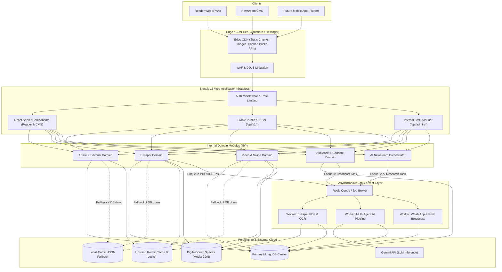

# LokSwami B3 — Architecture Specification

## 1. Core Architecture Strategy: Modular Monolith First

LokSwami B3 rejects premature microservice distributed architectures. 

Introducing distributed microservices prematurely adds high operational complexity (network serialization latency, distributed transactions, tracing overhead, independent deployment orchestration, and complex failure boundaries) without improving product delivery.

The B3 architectural progression is strictly governed by:

```
MODULAR MONOLITH
   ↓
STRONG DOMAIN BOUNDARIES
   ↓
STABLE API CONTRACTS (/api/v1)
   ↓
CACHE & CDN OPTIMIZATION
   ↓
ASYNC JOBS & QUEUES
   ↓
STANDALONE WORKERS
   ↓
DEEP OBSERVABILITY
   ↓
BENCHMARK & MEASURE BOTTLENECKS
   ↓
EXTRACT SERVICES ONLY WHEN MEASURABLY JUSTIFIED
```

Service extraction is permitted **only** when at least one of the following concrete drivers is proven through measurement:
1. **Independent Scaling Contention**: A workload (e.g., PDF page slicing or OCR) requires heavy CPU/memory that starves HTTP reader requests.
2. **Failure Isolation**: A crash-prone external dependency (e.g., headless browser or native C libraries) risks destabilizing the web server.
3. **Different Runtime / Hardware Requirements**: A service requires GPU acceleration (e.g., local AI embedding/inference) not available on standard web nodes.
4. **Security Isolation Boundary**: Sensitive payment or PII processing requires isolated VPC network boundaries.

---

## 2. Target High-Level Architecture Diagram



---

## 3. Subsystem Domain Boundaries

### 3.1 Content & Editorial Domain
- **Boundary**: Manages all editorial lifecycle logic, revisions, CAS locks, category taxonomies, and publication visibility.
- **Contract**: Pure domain services in `lib/content/` and `lib/server/`. Route handlers never directly execute raw Mongoose database queries; they delegate to domain service methods.
- **Rule**: Reader endpoints only receive content through `toPublicArticleItem()` projection filters. Unreleased or draft content cannot leak into public memory.

### 3.2 E-Paper Domain
- **Boundary**: Encapsulates daily editions, multi-page hierarchies, hotspot coordinate mappings, and reader clipping views.
- **Contract**: Heavy processing (PDF slicing, image scaling, and OCR text extraction) is completely removed from synchronous request paths.
- **State Flow**:
  ```
  Upload PDF → Record Staged Edition → Enqueue Worker Job → Slices Generated & Uploaded to CDN → OCR Text Suggested → Editor Review → Release Immutable Snapshot
  ```

### 3.3 Video & Swipe Domain
- **Boundary**: Media metadata management, feed curation, aspect ratio tagging, and playback telemetry.
- **Contract**: Video binaries are never routed through the Next.js process. Pre-signed upload URLs allow direct browser-to-Spaces transmission; playback consumes CDN edge streams.

### 3.4 Audience & Retention Domain
- **Boundary**: Reader identity, localized preferences (city/category), consent tracking, and outbound notifications.
- **Contract**: Decoupled from publication. Publishing an article or E-Paper edition enqueues an asynchronous notification event. Failure of message dispatch has zero impact on the article's published status.

### 3.5 AI Newsroom Domain
- **Boundary**: Multi-agent research, evidence compilation, draft authoring, headline variations, and SEO copy generation.
- **Contract**: Operates as an asynchronous background job producer. Outputs are staged in an `EvidencePackage` and presented to the human editor in the CMS. No automatic publishing route exists.

---

## 4. Public API Tier (`/api/v1`)

- `TARGET REQUIREMENT`:
  - Stable contract for web, PWA, and future native mobile apps:
    - `GET /api/v1/public/home-feed`: Complete homepage layout and rails.
    - `GET /api/v1/public/articles`: Paginated article index with category/tag filters.
    - `GET /api/v1/public/articles/:id`: Full article content and metadata.
    - `GET /api/v1/public/breaking`: Active high-priority breaking news alerts.
    - `GET /api/v1/public/epapers`: Edition index by date and city.
    - `GET /api/v1/public/epapers/:id`: Edition details, page asset URLs, and hotspots.
    - `GET /api/v1/public/shorts`: Cursor-paginated vertical video feed.
    - `GET /api/v1/public/search`: Full-text search and auto-complete suggestions.
- **Envelopes**: Consistent `{ success: true, data: T, meta?: { cursor, total } }` formats with RFC 7807 compliant error bodies.

---

## 5. Candidate Workloads for Worker Isolation

Before considering microservices, B3 isolates background workloads into dedicated Node.js worker processes sharing the same codebase:

1. **PDF & OCR Worker**: Rendering multi-page 300DPI newspapers to WebP and executing Tesseract OCR on Hindi scripts.
2. **AI Orchestration Worker**: Running multi-step LLM research workflows, web searches, and evidence extraction without holding open client HTTP connections.
3. **Distribution Worker**: Managing batched delivery of WhatsApp alerts and web push notifications with rate limiting and exponential backoff retries.
4. **Analytics Aggregator Worker**: Processing high-volume reader reading signals and compiling hourly/daily leadership performance summaries.
