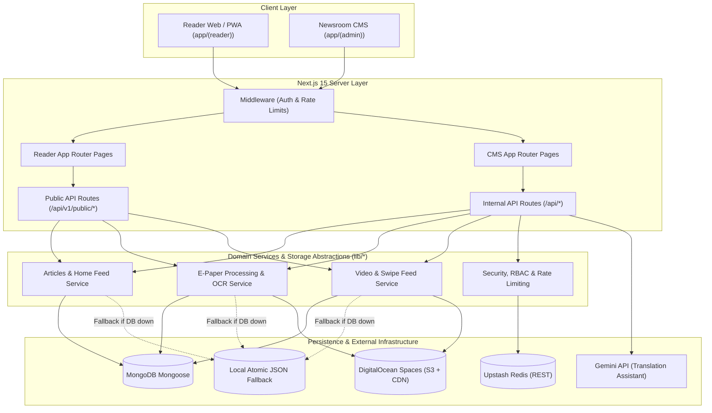

# LokSwami B3 — Current State Architecture & System Inventory

> [!IMPORTANT]
> **Descriptive Status Notice**: This document is descriptive only and reflects an audit of the current checkout. It must **never** override verified running repository code, active tests, schemas, or deployment configurations.

## 1. Architectural Overview

The LokSwami platform is a full-stack Next.js 15 (App Router) modular monolith built with TypeScript, Tailwind CSS, MongoDB/Mongoose, and NextAuth session authentication. It is deployed to production via a specialized Hostinger Node.js release runner and backed by GitHub Actions CI.

---

## 2. Verified Subsystem Audit

### 2.1 Reader Subsystem
- **Classification**: `CURRENT FACT`
- **Location**: `app/(reader)`
- **Key Routes**:
  - `app/(reader)/main/page.tsx`: Reader homepage loading `HomePageClient.tsx`.
  - `app/(reader)/main/article/[id]/page.tsx`: Server-rendered article detail with SEO schema.
  - `app/(reader)/main/epaper/page.tsx`: Interactive E-Paper edition viewer with hotspots.
  - `app/(reader)/main/shorts/page.tsx`: Vertical swipe short-video experience.
  - `app/(reader)/main/videos/page.tsx`: Video gallery and detail view.
  - `app/(reader)/main/saved/page.tsx`: Authenticated reader bookmarks.
  - `app/(reader)/main/preferences/page.tsx`: Reader topic and location settings.
- **State Management**: Zustand store (`lib/store/useReaderPreferences.ts`), SWR/fetch for dynamic client feeds.
- **Styling & Interaction**: Tailwind CSS with custom typography, Framer Motion for modals and drawer animations, Lucide icons.

### 2.2 Newsroom CMS Subsystem
- **Classification**: `CURRENT FACT`
- **Location**: `app/(admin)/admin`
- **Key Modules**:
  - `AdminShell.tsx`: Navigation sidebar, role-aware navigation items, session status.
  - `DeskWorkflowActions.tsx`: Stage transitions (`Draft → Submitted → Approved → Published`).
  - `/articles`: Article creation, Tiptap rich-text editing, SEO scoring, editorial locks.
  - `/epapers`: E-Paper upload (PDF/Drive import), page generation, hotspot editor, story linker.
  - `/videos`: Video upload, metadata editing, shorts flagging.
  - `/team`: User management, invite setup links, role assignments.
  - `/operations-diagnostics`: System health, DB connection status, Redis availability, storage checks.
  - `/audit-log`: Security and workflow audit event viewer.

### 2.3 API Architecture
- **Classification**: `CURRENT FACT`
- **Locations**:
  - Internal Endpoints: `app/api/admin/*`, `app/api/articles/*`, `app/api/epapers/*`, `app/api/auth/*`, `app/api/ai/*`, `app/api/security/*`.
  - Public v1 Endpoints: `app/api/v1/public/*` (`/articles`, `/home-feed`, `/breaking`, `/categories`, `/cities`, `/epapers`, `/search`, `/shorts`, `/videos`).
- **Data Transport**: JSON request/response envelopes with standardized `{ success: boolean, data?: T, error?: string }` responses.

### 2.4 Authentication & Newsroom RBAC
- **Classification**: `CURRENT FACT`
- **Engine**: NextAuth `5.0.0-beta.32` (`lib/auth.ts`, `auth.ts`, `middleware.ts`).
- **Roles**:
  - `super_admin`: Full system control, role assignment, security logs, environment verification.
  - `admin`: Full editorial authority, publication, scheduling, category management.
  - `copy_editor`: Copy-desk review, proofreading, headline and SEO tuning.
  - `reporter`: Draft authoring, story submission, own-article management.
  - `reader`: Public authentication, bookmarking, reading preferences.
  - Legacy mappings (`author → reporter`, `editor → copy_editor`, `viewer → reader`) maintained in `lib/auth/roles.ts`.
- **Session Strategy**: JWT session cookies (`LOKSWAMI_SESSION_COOKIE`), client-side and server-side validation.

### 2.5 Persistence & Resilience Layer
- **Classification**: `CURRENT FACT`
- **Primary Database**: MongoDB via Mongoose (`lib/db/mongoose.ts`).
  - Connection pooling with global caching across hot reloads.
  - Query timeouts (`MONGODB_PUBLIC_QUERY_TIMEOUT_MS = 2000`, `MONGODB_PUBLIC_PROBE_TIMEOUT_MS = 3000`).
- **Resilience / Fallback**: Atomic JSON file store in `lib/storage/` (`articlesFile.ts`, `storiesFile.ts`, `epapersFile.ts`, `videosFile.ts`).
  - Controlled by `isMongoAvailable({ label })` probe (`lib/db/mongoAvailability.ts`).
  - If MongoDB stalls or fails during public reading, routes seamlessly fall back to reading local file assets without throwing HTTP 500s.

### 2.6 Distributed Caching & Rate Limiting
- **Classification**: `CURRENT FACT`
- **Implementation**: `@upstash/redis` REST client (`lib/security/redisClient.ts`).
- **Circuit Breaker**: Trips for 60 seconds (`DEFAULT_CIRCUIT_COOLDOWN_MS = 60_000`) if Redis ping exceeds 150ms or encounters network errors.
- **Fail-Open Strategy**: Transparently falls back to in-memory sliding-window rate limiting (`lib/security/rateLimiter.ts`).

### 2.7 Media & Asset Storage
- **Classification**: `CURRENT FACT`
- **Provider**: DigitalOcean Spaces S3-compatible object storage (`lib/utils/digitalOceanSpaces.ts`).
- **Upload Strategy**: Direct pre-signed browser uploads for large video and story media; server-side buffer uploads for generated images and processed thumbnails.
- **CDN**: Configured via `DIGITALOCEAN_SPACES_CDN_BASE_URL`.

### 2.8 E-Paper Subsystem
- **Classification**: `CURRENT FACT`
- **Model**: `EPaper.ts`, `EPaperArticle.ts`, `EPaperProcessingJob.ts`.
- **Processing**:
  - PDF rendering via `pdfjs-dist` and `@napi-rs/canvas`.
  - Local Hindi OCR via `tesseract.js` (`@tesseract.js-data/hin`).
  - Standalone worker script: `scripts/epaper-local-ocr-worker.cjs`.
  - Distributed lock protection via `lib/security/distributedLock.ts`.

### 2.9 Video & Swipe / Shorts
- **Classification**: `CURRENT FACT`
- **Model**: `Video.ts`.
- **Feed Mechanism**: `lib/server/publicSwipeFeed.ts` using cursor pagination (`limit + cursorPublishedAt + cursorId`).
- **Player**: Responsive video components with lazy poster images and touch-event swipe listeners.

### 2.10 AI & TTS Status
- **Classification**: `CURRENT FACT`
- **AI Translation**: Gemini API (`gemini-2.5-flash`) via `app/api/admin/articles/assist/translate/route.ts` for bilingual editorial assistance.
- **Summarization**: Extractive sentence-ranking heuristic (`lib/ai/summarizer.ts`).
- **TTS**: Automated Gemini TTS was decommissioned in `lib/ai/geminiTts.ts`. All audio playback currently relies on editor-uploaded manual audio assets stored on DigitalOcean Spaces.

### 2.11 Sharing & SEO
- **Classification**: `CURRENT FACT`
- **Dynamic Previews**: Edge OG image generator at `/api/og` and canvas-based branded cards in `lib/server/socialPreviewImage.ts`.
- **SEO Governance**: Metadata builders in `lib/seo/articleSeo.ts`, dynamic sitemaps (`sitemap.ts`, `news-sitemap.xml`, `video-sitemap.xml`).
- **Social Automation**: Auto-drafting of social sharing copy in `lib/server/socialAutomation.ts`.

### 2.12 Testing & CI/CD
- **Classification**: `CURRENT FACT`
- **Unit & Integration Tests**: 158 Vitest test suites across `tests/`.
- **E2E & Smoke**: Playwright configuration (`playwright.config.mjs`) and custom smoke scripts (`scripts/smoke-check-deploy.js`, `scripts/browser-smoke-local.js`).
- **CI**: GitHub Actions workflow (`.github/workflows/ci.yml`) enforcing dependency security, linting, typecheck, `test:ci`, and `build:ci`.
- **Production Hostinger Pipeline**: Versioned release packaging (`scripts/prepare-hostinger.js`, `scripts/start-hostinger.js`) with release rollback support.

---

## 3. Known Gaps & Architectural Seams for B3 Evolution

1. **No External Message Queue**:
   - `CURRENT FACT`: Background jobs (E-Paper page slicing, OCR) currently run in-process or via ad-hoc spawned scripts.
   - `TARGET REQUIREMENT`: Dedicated job queue abstraction (Redis/BullMQ or DB-backed worker model) for heavy jobs.
2. **AI Editorial Pipeline Is Nascent**:
   - `CURRENT FACT`: Only manual translation and heuristic summarization exist.
   - `TARGET REQUIREMENT`: Orchestrated multi-agent newsroom pipeline (research, evidence, verification, draft, SEO, distribution).
3. **Distribution Worker Missing**:
   - `CURRENT FACT`: WhatsApp and push alerts cannot be safely broadcast to thousands of recipients synchronously.
   - `TARGET REQUIREMENT`: Dedicated asynchronous distribution queue with delivery telemetry and retry backoff.
