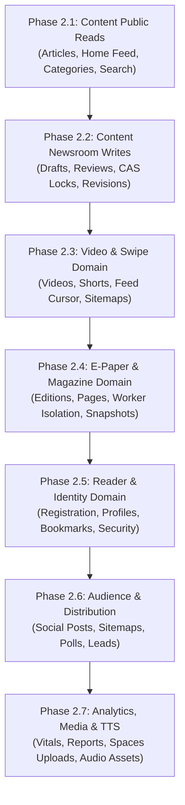

# LokSwami B3 — Phase 2 Implementation Plan
## Phased Modular Monolith Refactoring & Domain Decoupling

> **Parent Audit**: [PHASE2_DOMAIN_BOUNDARY_AUDIT.md](file:///c:/Users/Lenovo/OneDrive/Desktop/Lokswami_V3/Zaid-lokswami/docs/b3/PHASE2_DOMAIN_BOUNDARY_AUDIT.md)
> **Status**: APPROVED EXECUTION ROADMAP
> **Author**: Principal B3 Software Architect

---

## 1. Overview & Architecture Strategy

This implementation plan converts the Phase 2.0 Master Architecture Audit into a sequence of **7 backward-compatible refactoring slices** (Phase 2.1 through Phase 2.7).

At each step, the existing production application remains fully functional, all Phase 1 safety invariants are preserved, reader and CMS UIs are unchanged, and changes are validated by automated test suites before progression.

### Layer Separation Rule
```
HTTP / UI
    ↓
API Route / Controller (app/api/**)
    ↓
Domain Service / Application Service (lib/<domain>/*Service.ts)
    ↓
Repository / Infrastructure Adapter (lib/<domain>/*Repository.ts)
    ↓
MongoDB (Primary) / File Fallback / Upstash Redis / DO Spaces / Workers
```

---

## 2. Master Migration Sequence



---

## 3. Detailed Phase Slices

### Phase 2.1: Content Public Read Domain Boundaries

#### 1. Status: IMPLEMENTED & VERIFIED (Phase 2.1 Complete)
Decoupled all 11 public read endpoints for articles, home feed, categories, cities, and search from direct database queries, establishing pure server-only domain service and repository layers in `lib/server/content/`.

#### 2. Scope & Target Routes Migrated
- `app/api/v1/public/articles/route.ts` (GET public article list)
- `app/api/v1/public/articles/[slug]/route.ts` (GET public article detail)
- `app/api/v1/public/articles/latest/route.ts` (GET latest articles feed alias)
- `app/api/v1/public/home-feed/route.ts` (GET composed multi-domain home feed)
- `app/api/v1/public/breaking/route.ts` (GET breaking news ticker alias)
- `app/api/v1/public/categories/route.ts` (GET public category taxonomy)
- `app/api/v1/public/cities/route.ts` (GET public city taxonomy)
- `app/api/v1/public/search/route.ts` (GET public article search)
- `app/api/articles/latest/route.ts` (Legacy compatibility alias)
- `app/api/articles/[id]/route.ts` (Legacy compatibility alias)
- `app/api/breaking/route.ts` (Legacy compatibility alias)

#### 3. Files Created & Modified
- **NEW**: `lib/server/content/articleTypes.ts` (Public article DTOs, query filters, resolution tokens, legacy feed shapes, breaking models).
- **NEW**: `lib/server/content/articleRepository.ts` (Encapsulates Mongoose `Article.find()`, Mongo availability switching, projections, lean documents, and `articlesFile.ts` file fallback).
- **NEW**: `lib/server/content/publicArticleService.ts` (Public article domain service: lists, details, resolution, related items, latest feed, breaking ticker).
- **NEW**: `lib/server/content/publicTaxonomyService.ts` (Category and city taxonomy queries).
- **NEW**: `lib/server/content/publicHomeFeedService.ts` (Cross-domain composition service coordinating articles, EPaper, and Video readers).
- **NEW**: `tests/content-domain-boundaries.test.ts` (Comprehensive characterization tests for repository and service boundaries).
- **MODIFIED**: `lib/server/publicArticles.ts` (Clean backward-compatible server facade).
- **MODIFIED**: `lib/server/publicTaxonomy.ts` (Clean backward-compatible server facade).
- **MODIFIED**: `lib/server/publicHomeFeed.ts` (Clean backward-compatible server facade).
- **MODIFIED**: The 11 target route handlers to delegate directly to server domain services.

#### 4. Tests & Verification Summary
- **Characterization & Domain Tests**: `tests/content-domain-boundaries.test.ts` (11 tests pass), `tests/public-articles-service.test.ts` (12 tests pass), `tests/public-home-feed-service.test.ts` (3 tests pass).
- **Route Contract Suites**: `tests/api/public-v1-articles-routes.test.ts` (4 tests), `tests/api/public-articles-routes.test.ts` (4 tests), `tests/api/breaking-route.test.ts` (2 tests), `tests/api/public-home-feed-route.test.ts` (1 test), `tests/api/public-v1-taxonomy-routes.test.ts` (2 tests). Total focused: 39 tests passing across 8 files.
- **Phase 1 Regression Suites**: `tests/epaper-release-snapshot-safety.test.ts`, `tests/pdf-render-mutex-safety.test.ts`, `tests/storage-reader-credential-scrub.test.ts`, `tests/video-sitemap-route.test.ts` (31 tests pass).
- **Quality Gates**:
  - `npm run typecheck`: 0 errors.
  - `npm run lint:strict`: 0 warnings, 0 errors.
  - `npm run test:security`: 8 test files, 63 tests pass.
  - `npm run test:governance`: 4 test files, 16 tests pass.
  - `npm run test:four-role-newsroom`: 6 test files, 25 tests pass.
  - `npm run test:ci`: 208 test files, 989 tests pass + auth guards (7 cases) + admin credentials (6 cases).
  - `npm run build:ci`: Production build successful (exit code 0, 172/172 static pages).

#### 5. Definition of Done Met
- Zero raw Mongoose imports, `connectDB()`, or file store access in public article routes.
- Dual-persistence fallback (`isMongoAvailable`) completely encapsulated in repository layer.
- Strict backward compatibility maintained for all public read HTTP JSON contracts.

---

### Phase 2.2: Content Newsroom Writes & Editorial State Machine Decoupling

#### 1. Goal
Decouple administrative article mutations, optimistic concurrency versioning (CAS locks), revision history, audio resolution, and editorial state transitions from monolithic route handlers into a dedicated `EditorialService`, `NewsroomArticleRepository`, and supporting adapters while preserving 100% of existing contracts.

#### 2. Status
`COMPLETE (PASSED)`

#### 3. Scope & Target Routes Refactored
All 8 target administrative routes refactored into thin controllers:
- `app/api/admin/articles/route.ts` (117 lines, down from 899 lines — 87.0% reduction)
- `app/api/admin/articles/[id]/route.ts` (180 lines, down from 2,289 lines — 92.1% reduction)
- `app/api/admin/articles/[id]/lock/route.ts` (104 lines, down from 337 lines — 69.1% reduction)
- `app/api/admin/articles/[id]/revisions/route.ts` (53 lines, down from 132 lines — 59.8% reduction)
- `app/api/admin/articles/[id]/revisions/[revisionId]/restore/route.ts` (71 lines, down from 325 lines — 78.2% reduction)
- `app/api/admin/articles/[id]/activity/route.ts` (43 lines, down from 106 lines — 59.4% reduction)
- `app/api/admin/categories/route.ts` (56 lines, down from 175 lines — 68.0% reduction)
- `app/api/admin/categories/[id]/route.ts` (22 lines, down from 55 lines — 60.0% reduction)

#### 4. Files Created
- `lib/server/content/newsroomArticleTypes.ts` (188 lines): Domain types, CAS errors, revision snapshot definitions, input shapes.
- `lib/server/content/newsroomArticleRepository.ts` (481 lines): Newsroom article dual-persistence (Mongo/file), CAS conditional updates, revisions, assignee resolution.
- `lib/server/content/newsroomArticleValidation.ts` (742 lines): Input normalization, length/readiness validators, breaking-audio gate, list filtering.
- `lib/server/content/editorialService.ts` (778 lines): Newsroom article lifecycle orchestration (create, update, autosave, workflow transitions, fast-publish, delete, side effects).
- `lib/server/content/editorialRevisionService.ts` (207 lines): Revision history retrieval, rollback validation, and restore orchestration.
- `lib/server/content/articleLockRepository.ts` (281 lines): Editorial lock persistence (Mongo/file fallback), acquisition, renewal, takeover, heartbeat.
- `lib/server/content/adminTaxonomyService.ts` (192 lines): Category administration persistence and validation.
- `lib/server/epaper/adminArticleCompat.ts` (379 lines): Narrow compatibility adapter isolating legacy E-Paper story draft mutations without mutating `releasedSnapshot`.
- `tests/api/admin-article-workflow.test.ts` (460 lines): Dedicated characterization and regression tests for workflow transitions, 409 CAS conflicts, breaking-audio gates, and RBAC guards.

#### 5. Quality Gates & Test Verification
- **AST Architecture Assertion**: Zero occurrences of `@/lib/models/Article`, `connectDB`, `mongoose`, `@/lib/storage/articlesFile`, `Article.find*`, `Article.create`, `Article.update*`, `Article.delete*`, `updateStoredArticle`, or `deleteStoredArticle` across all 8 migrated admin routes.
- **Focused Newsroom Tests**: 7 test files, 69 tests pass (100%).
- **Phase 1 & Phase 2.1 Regression Guards**:
  - `tests/content-domain-boundaries.test.ts` (11 tests pass)
  - `tests/epaper-release-snapshot-safety.test.ts` (1 test pass)
  - `tests/pdf-worker-isolation.test.ts` (5 tests pass)
  - `tests/pdf-render-mutex-safety.test.ts` (9 tests pass)
  - `tests/storage-reader-credential-scrub.test.ts` (14 tests pass)
  - `tests/public-articles-service.test.ts` (12 tests pass)
  - `tests/api/public-articles-routes.test.ts` (4 tests pass)
  - `tests/api/public-v1-articles-routes.test.ts` (4 tests pass)
  - `tests/video-sitemap-route.test.ts` (7 tests pass)
  - `tests/api/public-v1-taxonomy-routes.test.ts` (2 tests pass)
  - `tests/reader-credentials-auth.test.ts` (8 tests pass)
- **Official Quality Gates**:
  - `npm run typecheck`: 0 errors.
  - `npm run lint:strict`: 0 warnings, 0 errors across all strict directories.
  - `npm run test:security`: 8 test files, 63 tests pass.
  - `npm run test:governance`: 4 test files, 16 tests pass.
  - `npm run test:four-role-newsroom`: 6 test files, 25 tests pass.
  - `npm run test:ci`: 209 test files, 998 tests pass + auth guards (7 cases) + admin credentials (synthetic 6 cases).
  - `npm run build:ci`: Production build successful (exit code 0, 172/172 static pages).
  - `git diff --check`: 0 whitespace or formatting errors.
  - Runtime data files committed: NONE (`data/*.json` clean).
  - UI/API contracts changed: NONE.
  - Phase 2.3 started: NO.

---

### Phase 2.3: Video & Swipe / Shorts Domain Decoupling

#### 1. Goal
Decouple video catalog management, vertical short-video feed pagination, aspect ratio classification, and video sitemaps into a dedicated `VideoService` and `VideoRepository`.

#### 2. Status
`COMPLETE / VERIFIED`

Phase 2.3 was resumed from the preserved local working tree at baseline
`dff1abf12dd51328927bdfb32a272da80207882a`; no reset, clean, or branch replacement was performed.

#### 3. Implemented Architecture
- `lib/server/video/videoTypes.ts` (146 lines): Video store, DTO, query, cursor, preview, and domain error contracts.
- `lib/server/video/videoRepository.ts` (335 lines): All Video Mongoose and `videosFile` persistence, authoritative mutation-store resolution, admin queries, public cursor reads, exact/legacy Swipe lookup, and home-feed Video reads.
- `lib/server/video/videoService.ts` (87 lines): Public regular-video, Swipe feed/detail, published Article preview, and home-feed orchestration.
- `lib/server/video/videoEditorialPolicy.ts` (456 lines): CMS input normalization, validation, workflow compatibility, list filtering/sorting, and serialization policy.
- `lib/server/video/videoEditorialService.ts` (478 lines): CMS list/detail/create/update/workflow/delete/activity orchestration with one pinned Video store per mutation.
- `lib/server/publicVideos.ts` (26 lines) and `lib/server/publicSwipeFeed.ts` (14 lines): Backward-compatible thin facades over the Video domain.
- `lib/server/content/publicHomeFeedService.ts`: Video persistence removed; E-Paper persistence intentionally unchanged for Phase 2.4.

The runtime dependency direction is now:

```text
HTTP controller / sitemap / home feed
    -> VideoService or VideoEditorialService
    -> VideoRepository
    -> MongoDB or videosFile fallback
```

Public non-mutating reads retain graceful Mongo-to-file fallback. Every multi-step Video mutation resolves `mongo` or `file` once and threads that store through the operation; a later Mongo failure is returned and never switches the write to file storage.

#### 4. Controller Reduction (Baseline -> Verified)
- `app/api/admin/videos/route.ts`: 635 -> 118 lines (81.4% reduction).
- `app/api/admin/videos/[id]/route.ts`: 1,006 -> 147 lines (85.4% reduction).
- `app/api/admin/videos/[id]/activity/route.ts`: 98 -> 51 lines (48.0% reduction).

All target admin/public Video controllers, the sitemap consumer, and both compatibility facades contain zero direct `Video` model, Mongoose, `connectDB`, or `videosFile` persistence usage.

#### 5. Contract Verification
- Admin: list, draft, submit, publish, publish RBAC, detail, Mongo invalid IDs, file non-ObjectId IDs, update, both legacy `isPublished` directions, workflow, assignment, fast-publish, archive, delete, activity, Mongo/file paths, and one-store-only mutation behavior.
- Public Video: regular `publishedAt`/ID cursor behavior, publication filtering, Mongo read fallback, and file fallback.
- Swipe: default limit 8, `createdAt` primary cursor with `publishedAt` fallback, future/unpublished/processing/failed/16:9 exclusion, legacy metadata eligibility, exact slug, generated legacy slug, published Article preview, 404/503 contracts, and cache headers.
- Sitemap: regular `/main/videos?video=<id>` and short `/main/shorts/<slug>` paths, pagination beyond 50, cursor-loop protection, ID/URL dedupe, and XML fields.
- Home feed: Video/short output compatibility preserved with no Video persistence in the composer.

#### 6. Quality Gates & Exact Results
- Focused Phase 2.3 suite: 9 test files, 63 tests passed.
- `npm run typecheck`: passed, 0 errors.
- `npm run lint:strict`: passed, 0 warnings and 0 errors.
- `npm run test:security`: 8 test files, 63 tests passed.
- `npm run test:governance`: 4 test files, 16 tests passed (including typecheck).
- `npm run test:four-role-newsroom`: 6 test files, 25 tests passed (including typecheck).
- `npm run test:ci`: 211 test files, 1,045 tests passed; auth guards 7/7; synthetic admin credentials 6/6.
- `npm run build:ci`: passed; production compilation succeeded and 172/172 static pages generated.
- Explicit safety regression set: 14 test files, 117 tests passed, covering PDF worker isolation, PDF render mutex, E-Paper release snapshots, reader credentials and fail-closed registration, credential scrub, video sitemap, public Articles, content boundaries, newsroom Article workflow, and Phase 2.2 compatibility hardening.
- `git diff --check`: passed; runtime data files are clean.

Phase 2.4 has not been started.

---

### Phase 2.4: E-Paper & E-Magazine Domain Decoupling

**Status**: `COMPLETE` on the authoritative foundation baseline `8291d6f3a9723507b1f31ba2faf5b00d11bca5fe`.

#### 1. Implemented Architecture
The E-Paper and E-Magazine domain now follows this dependency direction:

```text
HTTP controller / public home-feed composer
    -> E-Paper application service
    -> EpaperRepository or EpaperWorkerAdapter
    -> MongoDB / inherited E-Paper file fallback / isolated PDF and OCR workers
```

`lib/server/epaper/` now contains the shared types, mappers, repository, public query service, editorial lifecycle service, article/release service, page service, OCR service, processing service, revision service, metadata service, manual TTS service, crop service, upload service, and worker adapter. `EPaper`, `EPaperArticle`, `EPaperOcrSuggestion`, `EPaperProcessingJob`, Mongoose, and `epapersFile` access were removed from every migrated controller and from `PublicHomeFeedService`. The pre-existing `adminArticleCompat.ts` remains the intentionally isolated compatibility seam for Article-owned routes.

The 22 migrated controllers cover admin edition CRUD/activity, pages, articles, explicit release, OCR review/queueing, processing/retry, revisions, crop, manual TTS, upload initialization/finalization/import, cron dispatch, legacy public list/detail/story-TTS, and the public PDF redirect. Request parsing, authentication, HTTP status mapping, response envelopes, and cache headers remain in the controllers; persistence and workflow decisions live in the domain.

#### 2. Controller Reduction (Foundation -> Verified)
- `app/api/admin/epapers/route.ts`: 752 -> 43 physical source lines (94.3% reduction).
- `app/api/admin/epapers/[id]/route.ts`: 1,011 -> 71 physical source lines (93.0% reduction; below the required 200-line ceiling).
- `app/api/admin/epapers/[id]/pages/route.ts`: 521 -> 29 physical source lines (94.4% reduction).
- `app/api/admin/epapers/[id]/articles/route.ts`: 394 -> 37 physical source lines (90.6% reduction).
- `app/api/epapers/[id]/route.ts`: 326 -> 25 physical source lines (92.3% reduction).
- `app/api/public/epapers/[id]/pdf/route.ts`: 129 -> 22 physical source lines (82.9% reduction).

All migrated routes are 71 physical source lines or fewer and contain zero direct E-Paper model, Mongoose, `connectDB`, `Types.ObjectId`, or `epapersFile` imports.

#### 3. Safety and Compatibility Guarantees
- `releasedSnapshot` is still the sole public story payload. Ordinary editorial saves never mutate it. Explicit release is idempotent for an already-released saved version, increments the version only after a validated draft, and uses an `updatedAt` compare-and-set so a concurrent edit returns `409` instead of publishing stale content. The characterized sequence proves public V1 -> draft edit -> public V1 -> explicit release -> public V2.
- The worker adapter delegates to the inherited queue APIs; the native PDF worker implementation, render mutex, timeout/termination/recycle behavior, retry leases, cleanup, OCR language assets, and no-overlap guard were not rewritten or bypassed.
- Public E-Paper reads retain the inherited Mongo-to-file fallback. File storage is never used to manufacture E-Magazine data: E-Magazine file fallback is empty/not-found. Mutations remain Mongo-backed where previously required and do not switch stores after a failed write.
- Legacy E-Paper and E-Magazine response fields, filtering, cursor behavior, manual TTS contracts, public PDF `302` plus `Cache-Control: no-store`, RBAC, and reader/admin routes are preserved.
- `PublicHomeFeedService` receives E-Paper/E-Magazine results from `epaperService`; it no longer imports raw E-Paper models or file storage.

#### 4. Verification Evidence
- Focused Phase 2.4 contract/architecture/release suite: 5 test files, 42 tests passed.
- Complete discovered E-Paper/PDF Vitest inventory: 32 files, 157 tests passed.
- Tracked Playwright E-Paper/E-Magazine reader smoke suite: 1 file, 4/4 desktop/mobile cases passed.
- Cross-domain Content, home-feed, Article workflow, and Video regression set: 6 files, 54 tests passed.
- `npm run typecheck`: passed, 0 errors.
- `npm run lint:strict`: passed, 0 warnings and 0 errors.
- `npm run verify:dependency-security`: passed all tracked advisory ranges.
- `npm run test:security`: 8 files, 63 tests passed.
- `npm run test:governance`: 4 files, 16 tests passed (including typecheck).
- `npm run test:four-role-newsroom`: 6 files, 25 tests passed (including typecheck).
- `npm run test:ci`: 215 files, 1,086 tests passed; auth guards 7/7; synthetic admin credentials 6/6.
- `npm run build:ci`: passed; optimized production compilation succeeded and 172/172 static pages generated.
- `git diff --check`: passed; dependency manifests, runtime JSON, generated output, and secrets are unchanged.

Phase 2.5 follows from the verified Phase 2.4 foundation.

---

### Phase 2.5: Reader & Identity Domain Decoupling

#### 1. Status: IMPLEMENTED & VERIFIED (Phase 2.5 Complete)
Reader registration, Reader credential authentication, profile/settings operations, saved articles, and reading history now cross a cohesive application boundary in `lib/server/reader/`. MongoDB remains the only credential authority and the only persistence authority for saved articles and read tracking.

#### 2. Scope & Target Routes
- `app/api/auth/register/route.ts`
- `app/api/auth/[...nextauth]/route.ts`
- `app/api/user/profile/route.ts`
- `app/api/user/save/route.ts`
- `app/api/user/track/route.ts`

#### 3. Implemented Architecture
- `lib/server/reader/readerTypes.ts`: narrow session, registration, profile, saved-article, authentication, and domain-error contracts.
- `lib/server/reader/readerRepository.ts`: the sole Reader-domain owner of raw `User`, `Article`, Mongo connection, and legacy `usersFile` access; it returns persistence-neutral values and never exposes Mongoose queries.
- `lib/server/reader/readerIdentityService.ts`: validation, bcrypt-backed registration, eligible-Reader credential verification, and fail-closed Mongo authority.
- `lib/server/reader/readerService.ts`: profile/settings, password mutation, bookmark, and read-history workflows.
- `lib/auth/readerCredentials.ts`: retained as the stable NextAuth compatibility facade and delegates only Reader credential work to `ReaderIdentityService`.
- Registration, profile, save, and track routes are thin HTTP/session/error-mapping controllers. The three-line NextAuth route and shared `lib/auth.ts` configuration were deliberately left unchanged.

#### 4. Preserved Contracts and Security Invariants
- Registration keeps validation/status/envelope behavior, bcrypt cost, duplicate detection, `reader`/active defaults, and best-effort non-secret profile projection. Mongo failure returns the historical 503 and never creates file-only credentials.
- Reader login normalizes identifiers, accepts only active Reader records with an authoritative Mongo password hash, and fails closed for missing/unreachable Mongo. Admin/staff provider order and Google/OAuth, JWT, session, cookie, redirect, and account-linking behavior are unchanged.
- Password changes verify and write only through Mongo; a Mongo read or write failure returns the historical 503 and never mutates the file profile.
- `usersFile` remains a non-secret Reader profile adapter. Reader `passwordHash` and `passwordSetAt` keys are scrubbed recursively from top-level, nested, corrupt, and spread-based input while non-Reader credentials retain their existing behavior.
- Profile GET/PATCH retains its existing non-secret file fallback. Saved articles and read tracking remain Mongo-only, saved ordering is stable, tracking remains append-only in foundation order, and the verified history cap is 50 entries.
- Existing middleware remains the rate-limit authority: registration uses the auth bucket (10/minute per client IP); profile, save, and track use the generic API bucket (100/minute per route/client IP).

#### 5. Verification Evidence
- Focused Reader/Auth: 12 files, 88 tests passed.
- Security: 8 files, 63 tests passed.
- Governance: 4 files, 16 tests passed.
- Four-role newsroom: 6 files, 25 tests passed.
- Full `test:ci`: 219 Vitest files, 1,116 tests passed; 7 auth guards and 6 synthetic admin credential cases passed.
- `npm run typecheck`, `npm run lint:strict`, and dependency security passed.
- `npm run build:ci`: passed; optimized production compilation succeeded and 172/172 static pages generated.

#### 6. Known P2 / Future Debt
- The Mongo `User` collection remains physically shared across Reader and privileged identities; ownership is enforced by the repository/service boundary rather than separate schemas.
- Reader profile resilience still depends on the legacy JSON adapter by compatibility requirement, although credential material is prohibited and recursively scrubbed.
- Read tracking preserves the foundation's append-only semantics and 50-entry cap; deduplication would be a behavior change and is deferred.
- The existing Vite native-config compatibility warning and slow local Next.js trace collection are inherited tooling concerns.

Phase 2.6 has been completed and verified.

---

### Phase 2.6: Audience & Distribution Domain Decoupling

#### 1. Status: IMPLEMENTED & VERIFIED (Phase 2.6 Complete)
Decoupled audience capture (newsletter subscriptions, marketing leads, commercial advertising inquiries, career applications), contact messages & administrative workflow inbox, elections management, social distribution lifecycle, and XML sitemaps from direct storage queries, establishing explicit domain service and repository layers in `lib/server/audience/`, `lib/server/distribution/`, and content-owned facades in `lib/server/content/`.

#### 2. Architecture & Domain Ownership
- **Audience Domain (`lib/server/audience/`)**:
  - `audienceTypes.ts`: Domain models for newsletter subscriptions, marketing leads, advertise inquiries, career applications, contact workflows, and election assets.
  - `audienceRepository.ts`: Persistence adapter for `Subscriber` (MongoDB only; zero file fallback), `MarketingLead`, `AdvertiseInquiry`, and `CareerApplication` (Mongo-first with catch-block JSON fallback).
  - `audienceCaptureService.ts`: Business logic, honeypot detection, input normalization, and validation for public capture routes.
  - `contactRepository.ts`: Persistence adapter for `ContactMessage` Mongo collection and file store fallback, including pagination, status filtering, and workflow notes.
  - `contactService.ts`: Ticket generation (`generateContactTicketId`), acknowledgement email orchestration, anti-bot verification (`verifyAntiBot`), rate limiting, deduplication, and workflow updates.
  - `electionAssetRepository.ts`: File-based storage operations for state election graphics.
  - `electionAudienceService.ts`: Public and admin election results reading/writing and graphic asset lifecycle.
- **Distribution Domain (`lib/server/distribution/`)**:
  - `distributionTypes.ts`: Domain models for social posts, platform targets, status lifecycle, and actor identities.
  - `socialPostRepository.ts`: Persistence adapter for `SocialPost` Mongo and file storage.
  - `socialDistributionService.ts`: Social post listing, metadata updates, draft generation orchestration, and automation webhook dispatch.
  - `lib/server/socialAutomation.ts`: Webhook payload generation and provider credential redaction (`redactProviderSecrets`).
- **Content-Owned Query Facades (`lib/server/content/`)**:
  - `socialDistributionContentQueryService.ts`: Content query facade allowing Distribution to look up Story and Article data without owning Content persistence.
  - `sitemapContentQueryService.ts`: Content query facade providing chunked article counting, article slicing, e-paper listings, news articles, and bounded video feed pagination for all sitemaps.

#### 3. Route Discrepancies & Audit Findings
- **Marketing Lead Route**: Documented historically as `/api/marketing-leads`; actual implementation is `app/api/marketing/lead/route.ts`. Preserved exact existing path.
- **Advertise Inquiry Route**: Documented historically as `/api/advertise`; actual implementation is `app/api/advertise/inquiry/route.ts`. Preserved exact existing path.
- **Push Route Investigation**: Full repository scan confirmed no `PushSubscription`, `webpush`, or `p256dh` implementations exist. No artificial push endpoint was introduced in Phase 2.6.
- **Fast-Publish Investigation**: Confirmed that `/api/admin/videos/[id]/fast-publish` does not exist and never existed in git history. Video urgent publication is handled via standard workflow action `fast_publish` on `app/api/admin/videos/[id]/route.ts` routing to `videoEditorialService.applyWorkflowAction`, pinned by boundary tests.

#### 4. Scope & Target Routes Migrated
- `app/api/subscribe/route.ts` (POST newsletter capture)
- `app/api/marketing/lead/route.ts` (POST marketing lead capture)
- `app/api/advertise/inquiry/route.ts` (POST commercial advertise inquiry)
- `app/api/careers/apply/route.ts` (POST career application)
- `app/api/contact/route.ts` (POST public contact submission)
- `app/api/admin/contact-messages/route.ts` (GET contact messages list with pagination & counts)
- `app/api/admin/contact-messages/[id]/route.ts` (GET contact detail, PATCH workflow updates)
- `app/api/elections/results/route.ts` (GET public election results with cache headers)
- `app/api/admin/elections/results/route.ts` (GET/POST admin election results)
- `app/api/admin/elections/upload/route.ts` (POST admin election graphic upload)
- `app/api/admin/elections/delete/route.ts` (POST admin election graphic deletion)
- `app/api/admin/social-posts/route.ts` (GET social post list with RBAC)
- `app/api/admin/social-posts/[id]/route.ts` (PATCH social post updates)
- `app/api/admin/social-posts/[id]/dispatch/route.ts` (POST automation dispatch with retry & redaction)
- `app/api/admin/social-posts/generate/route.ts` (POST social post draft generation via facade)
- `app/sitemap.ts` (MetadataRoute standard chunked dynamic sitemap)
- `app/news-sitemap.xml/route.ts` (GET Google News XML sitemap)
- `app/video-sitemap.xml/route.ts` (GET Google Video XML sitemap with bounded pagination & loop protection)

#### 5. Verification Evidence
- Focused Phase 2.6 test suites: 6 files, 30 tests passed (`tests/phase2-audience-distribution-boundaries.test.ts`, `tests/api/audience-capture-routes.test.ts`, `tests/api/audience-inbox-election-routes.test.ts`, `tests/api/admin-social-post-routes.test.ts`, `tests/api/admin-social-post-dispatch-route.test.ts`, `tests/social-automation.test.ts`).
- Cross-phase regressions: Phase 1 (28 tests), Phase 2.1 (22 tests), Phase 2.2 (39 tests), Phase 2.3 (44 tests), Phase 2.4 (44 tests), Phase 2.5 (68 tests) passed cleanly.
- Security: 8 files, 63 tests passed (`npm run test:security`).
- Governance: 4 files, 16 tests passed (`npm run test:governance`).
- Four-role newsroom: 6 files, 25 tests passed (`npm run test:four-role-newsroom`).
- Full Vitest suite: 223 Vitest files, 1,141 tests passed (100% green).
- Auth guards (7 cases) & Admin credentials (6 cases) passed.
- `npm run typecheck`, `npm run lint:strict`, and `npm run verify:dependency-security` passed with 0 errors / 0 warnings.
- `npm run build:ci` passed; production bundle built cleanly with 258 routes.

#### 6. Known P2 / Future Debt
- Polls domain routes (`app/api/poll/*`, `app/api/admin/polls/*`) continue on their stable historical persistence adapter.
- Web push notification subscriptions deferred until a dedicated push delivery subsystem is scoped.
- Video publication preserves the unified workflow action route pattern rather than dedicated single-action endpoints.

Phase 2.7 has not been started.

---

### Phase 2.7: Analytics, Media Storage & Audio Decoupling

#### 1. Status: IMPLEMENTED & VERIFIED (Phase 2.7 Complete)
Decoupled public analytics event ingestion, Web Vitals privacy tracking, leadership reporting schedules, Media catalog CRUD, DigitalOcean Spaces storage operations, Sharp image optimization pipelines, and manual TTS audio asset management into dedicated domain services and repositories in `lib/server/analytics/`, `lib/server/media/`, and `lib/server/audio/`.

#### 2. Architecture & Domain Ownership
- **Analytics Domain (`lib/server/analytics/`)**:
  - `analyticsTypes.ts`: Event payloads, public track inputs, request context, and Web Vitals result contracts.
  - `analyticsRepository.ts`: Pure persistence adapter managing Mongo `AnalyticsEvent` creation with automatic `createStoredAnalyticsEvent` file store fallback.
  - `analyticsService.ts`: Public event validation (`EVENT_REGEX`, `SOURCE_REGEX`), session handling, anonymous Swipe privacy (zero IP / UA, `SWIPE_METADATA_KEYS` filter), non-swipe browserLanguage / countryCode enrichment, and Web Vitals privacy (zero IP / UA, metric normalization).
  - `analyticsReportService.ts`: Leadership reporting schedule query coordination and health snapshot orchestration.
- **Media Storage Domain (`lib/server/media/`)**:
  - `mediaTypes.ts`: Media records, upload purposes, upload validation rules, image crop variants, and upload results.
  - `spacesAdapter.ts`: Provider adapter wrapping `lib/utils/digitalOceanSpaces.ts` without rewriting SigV4 signing or exposing credentials.
  - `mediaRepository.ts`: Persistence adapter for `Media` Mongoose collection and `data/media.json` fallback, including reporter desk role scoping.
  - `mediaImageService.ts`: Isolated Sharp image optimization pipeline generating primary WebP (quality 88), AVIF (quality 64), and responsive focal crops (`landscape16x9`, `standard4x3`, `square1x1`).
  - `mediaService.ts`: Media catalog CRUD orchestration and upload validation/processing.
- **Audio / TTS Domain (`lib/server/audio/`)**:
  - `ttsTypes.ts`: TTS asset filters, summaries, cleanup inputs, revalidation results, and manual settings contracts.
  - `ttsRepository.ts`: Persistence adapter for `TtsAsset`, `TtsAuditEvent`, and `TtsConfig` collections, aggregations, cleanup queries, and settings counts. Business metadata resides solely in MongoDB with no JSON file fallback.
  - `ttsService.ts`: TTS asset listing and aggregation, retention-based cleanup with dry-run support, remote/local audio storage revalidation, manual-only settings status, and audit logging.
  - `lib/utils/ttsStorage.ts`: Physical audio file storage adapter managing DigitalOcean Spaces (primary when configured) and local filesystem storage (`public/uploads/tts`, `storage/uploads/tts`).

#### 3. Stale-Doc Discrepancies & Real Findings
- **Live Analytics Transport**: Stale docs mentioned SSE streams; repository reality contains BOTH JSON snapshot polling with `no-store` (`app/api/admin/analytics/live/route.ts`) and an SSE stream (`app/api/admin/analytics/live/stream/route.ts`). Both contracts are preserved without adding external pub/sub infrastructure.
- **Manual TTS Only**: Automatic TTS / Gemini TTS synthesis was decommissioned. Settings PUT intentionally returns 405 Method Not Allowed and records skipped audit event; prewarm returns 410 Gone; retry returns 405 Method Not Allowed. No AI speech generation was reintroduced.
- **TTS Metadata vs. Physical Storage**: TTS business metadata is persisted strictly in MongoDB (`TtsAsset`, `TtsAuditEvent`, `TtsConfig`) with no file store fallback (`data/tts-assets.json` does not exist). Physical audio `.mp3` files are stored in DigitalOcean Spaces or local storage via `lib/utils/ttsStorage.ts`.
- **Privacy Invariants**: Web Vitals beacon tracking and anonymous Swipe tracking strictly enforce `ipAddress = ''` and `userAgent = ''`.

#### 4. Scope & Target Routes Migrated
- `app/api/analytics/track/route.ts` (POST public analytics tracking)
- `app/api/v1/public/analytics/vitals/route.ts` (POST public Web Vitals beacon)
- `app/api/admin/settings/leadership-reports/route.ts` (GET leadership report settings)
- `app/api/admin/media/route.ts` (GET list, POST create media assets)
- `app/api/admin/media/[id]/route.ts` (DELETE media asset)
- `app/api/admin/upload/route.ts` (POST general upload with Sharp optimizations)
- `app/api/admin/tts/assets/route.ts` (GET TTS assets listing with aggregations)
- `app/api/admin/tts/cleanup/route.ts` (POST TTS expired asset cleanup)
- `app/api/admin/tts/revalidate/route.ts` (POST TTS storage presence revalidation)
- `app/api/admin/tts/settings/route.ts` (GET settings, PUT 405 rejection)

#### 5. Verification Evidence
- Focused Phase 2.7 test suites: 11 files, 56 tests passed (`tests/phase2-analytics-media-tts-boundaries.test.ts`, `tests/analytics-domain-service.test.ts`, `tests/media-domain-service.test.ts`, `tests/tts-domain-service.test.ts`, `tests/api/admin-tts-routes.test.ts`, `tests/api/swipe-analytics-privacy.test.ts`, `tests/api/admin-upload-route.test.ts`, `tests/api/admin-article-tts-upload-routes.test.ts`, `tests/api/admin-breaking-tts-upload-routes.test.ts`, `tests/tts-manual-assets.test.ts`, `tests/epaper-revision-tts-clone.test.ts`).
- Cross-phase regressions: Phase 1 (28 tests), Phase 2.1 (22 tests), Phase 2.2 (39 tests), Phase 2.3 (44 tests), Phase 2.4 (44 tests), Phase 2.5 (68 tests), Phase 2.6 (30 tests) passed cleanly.
- Security: 8 files, 63 tests passed (`npm run test:security`).
- Governance: 4 files, 16 tests passed (`npm run test:governance`).
- Four-role newsroom: 6 files, 25 tests passed (`npm run test:four-role-newsroom`).
- Full Vitest suite: 228 Vitest files, 1,178 tests passed (100% green).
- Auth guards (7 cases) & Admin credentials (6 cases) passed.
- `npm run typecheck`, `npm run lint:strict`, and `npm run verify:dependency-security` passed with 0 errors / 0 warnings.
- `npm run build:ci` passed; production bundle built cleanly with zero errors.

#### 6. Known P2 / Future Debt
- Live analytics snapshot polling remains local in-memory aggregation rather than distributed pub/sub.
- Sharp image processing runs in-process in the Node runtime; offloading to dedicated image workers is deferred to production infrastructure phases.
- Manual audio storage presence checks verify local files via fs and HTTP URLs via status check.

### Final Integration Audit Status
- **Phase 2.1 — Content Public Reads**: COMPLETE
- **Phase 2.2 — Content Newsroom Writes**: COMPLETE
- **Phase 2.3 — Video & Swipe Domain**: COMPLETE
- **Phase 2.4 — E-Paper & E-Magazine Domain**: COMPLETE
- **Phase 2.5 — Reader & Identity Domain**: COMPLETE
- **Phase 2.6 — Audience & Distribution Domain**: COMPLETE
- **Phase 2.7 — Analytics, Media & Manual TTS**: COMPLETE
- **Final Phase-2 Integration Audit**: READY FOR FINAL ARCHITECTURE FREEZE REVIEW (PR #9 open; canonical audit report in `docs/b3/PHASE2_FINAL_INTEGRATION_AUDIT.md`, architecture frozen in `docs/b3/ARCHITECTURE_FREEZE_V1.md`, debt cataloged in `docs/b3/PHASE2_DEBT_REGISTER.md`).
- **PR #9 Status**: OPEN (NOT MERGED).
- **Phase 3 Implementation**: NOT STARTED.


---

## 4. Rollback & Verification Protocol

For each migration slice:
1. **Pre-flight**: Ensure working tree is clean on the phase-specific branch.
2. **Implementation**: Build domain types, repository, and service before modifying route handlers.
3. **Focused Verification**: Run targeted domain tests (`npx vitest run tests/<domain>-*.test.ts`).
4. **Static Analysis**: Run `npm run typecheck` and `npm run lint`.
5. **Full Suite Gate**: Run `npm run test:ci` across all 207 test files.
6. **Production Build Gate**: Run `npm run build:ci` to guarantee zero bundling or SSR breakage.
7. **Rollback Trigger**: If a regression occurs that cannot be resolved within the slice boundary, `git checkout` the slice branch back to the pre-slice commit SHA.

---

## 5. Phase 2 Exit Criteria

Phase 2 is considered complete **only** when:
1. All 154 HTTP route handlers delegate business rules and persistence to pure domain services.
2. Zero Mongoose model queries or `connectDB()` calls remain directly inside `app/api/**` route files.
3. All Phase 1 safety invariants remain 100% green in CI.
4. `npm run test:ci` passes all 207 test suites.
5. `npm run build:ci` succeeds with 0 errors.
6. Documentation is updated to reflect active domain interfaces.
