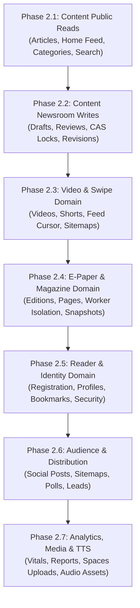

# LokSwami B3 — Phase 2 Implementation Plan
## Phased Modular Monolith Refactoring & Domain Decoupling

> **Parent Audit**: [PHASE2_DOMAIN_BOUNDARY_AUDIT.md](file:///c:/Users/Lenovo/OneDrive/Desktop/Lokswami_V3/Zaid-lokswami/docs/b3/PHASE2_DOMAIN_BOUNDARY_AUDIT.md)
> **Status**: APPROVED EXECUTION ROADMAP
> **Author**: Principal B3 Software Architect

---

## 1. Overview & Architecture Strategy

This implementation plan converts the Phase 2.0 Master Architecture Audit into a sequence of **7 backward-compatible refactoring slices** (Phase 2.1 through Phase 2.7).

At each step, the existing production application remains fully functional, all Phase 1 safety invariants are preserved, reader and CMS UIs are unchanged, and changes are validated by automated test suites before progression.

### Layer Separation Rule
```
HTTP / UI
    ↓
API Route / Controller (app/api/**)
    ↓
Domain Service / Application Service (lib/<domain>/*Service.ts)
    ↓
Repository / Infrastructure Adapter (lib/<domain>/*Repository.ts)
    ↓
MongoDB (Primary) / File Fallback / Upstash Redis / DO Spaces / Workers
```

---

## 2. Master Migration Sequence



---

## 3. Detailed Phase Slices

### Phase 2.1: Content Public Read Domain Boundaries

#### 1. Status: IMPLEMENTED & VERIFIED (Phase 2.1 Complete)
Decoupled all 11 public read endpoints for articles, home feed, categories, cities, and search from direct database queries, establishing pure server-only domain service and repository layers in `lib/server/content/`.

#### 2. Scope & Target Routes Migrated
- `app/api/v1/public/articles/route.ts` (GET public article list)
- `app/api/v1/public/articles/[slug]/route.ts` (GET public article detail)
- `app/api/v1/public/articles/latest/route.ts` (GET latest articles feed alias)
- `app/api/v1/public/home-feed/route.ts` (GET composed multi-domain home feed)
- `app/api/v1/public/breaking/route.ts` (GET breaking news ticker alias)
- `app/api/v1/public/categories/route.ts` (GET public category taxonomy)
- `app/api/v1/public/cities/route.ts` (GET public city taxonomy)
- `app/api/v1/public/search/route.ts` (GET public article search)
- `app/api/articles/latest/route.ts` (Legacy compatibility alias)
- `app/api/articles/[id]/route.ts` (Legacy compatibility alias)
- `app/api/breaking/route.ts` (Legacy compatibility alias)

#### 3. Files Created & Modified
- **NEW**: `lib/server/content/articleTypes.ts` (Public article DTOs, query filters, resolution tokens, legacy feed shapes, breaking models).
- **NEW**: `lib/server/content/articleRepository.ts` (Encapsulates Mongoose `Article.find()`, Mongo availability switching, projections, lean documents, and `articlesFile.ts` file fallback).
- **NEW**: `lib/server/content/publicArticleService.ts` (Public article domain service: lists, details, resolution, related items, latest feed, breaking ticker).
- **NEW**: `lib/server/content/publicTaxonomyService.ts` (Category and city taxonomy queries).
- **NEW**: `lib/server/content/publicHomeFeedService.ts` (Cross-domain composition service coordinating articles, EPaper, and Video readers).
- **NEW**: `tests/content-domain-boundaries.test.ts` (Comprehensive characterization tests for repository and service boundaries).
- **MODIFIED**: `lib/server/publicArticles.ts` (Clean backward-compatible server facade).
- **MODIFIED**: `lib/server/publicTaxonomy.ts` (Clean backward-compatible server facade).
- **MODIFIED**: `lib/server/publicHomeFeed.ts` (Clean backward-compatible server facade).
- **MODIFIED**: The 11 target route handlers to delegate directly to server domain services.

#### 4. Tests & Verification Summary
- **Characterization & Domain Tests**: `tests/content-domain-boundaries.test.ts` (11 tests pass), `tests/public-articles-service.test.ts` (12 tests pass), `tests/public-home-feed-service.test.ts` (3 tests pass).
- **Route Contract Suites**: `tests/api/public-v1-articles-routes.test.ts` (4 tests), `tests/api/public-articles-routes.test.ts` (4 tests), `tests/api/breaking-route.test.ts` (2 tests), `tests/api/public-home-feed-route.test.ts` (1 test), `tests/api/public-v1-taxonomy-routes.test.ts` (2 tests). Total focused: 39 tests passing across 8 files.
- **Phase 1 Regression Suites**: `tests/epaper-release-snapshot-safety.test.ts`, `tests/pdf-render-mutex-safety.test.ts`, `tests/storage-reader-credential-scrub.test.ts`, `tests/video-sitemap-route.test.ts` (31 tests pass).
- **Quality Gates**:
  - `npm run typecheck`: 0 errors.
  - `npm run lint:strict`: 0 warnings, 0 errors.
  - `npm run test:security`: 8 test files, 63 tests pass.
  - `npm run test:governance`: 4 test files, 16 tests pass.
  - `npm run test:four-role-newsroom`: 6 test files, 25 tests pass.
  - `npm run test:ci`: 208 test files, 989 tests pass + auth guards (7 cases) + admin credentials (6 cases).
  - `npm run build:ci`: Production build successful (exit code 0, 172/172 static pages).

#### 5. Definition of Done Met
- Zero raw Mongoose imports, `connectDB()`, or file store access in public article routes.
- Dual-persistence fallback (`isMongoAvailable`) completely encapsulated in repository layer.
- Strict backward compatibility maintained for all public read HTTP JSON contracts.

---

### Phase 2.2: Content Newsroom Writes & Editorial State Machine Decoupling

#### 1. Goal
Decouple administrative article mutations, optimistic concurrency versioning (CAS locks), revision history, audio resolution, and editorial state transitions from monolithic route handlers into a dedicated `EditorialService`, `NewsroomArticleRepository`, and supporting adapters while preserving 100% of existing contracts.

#### 2. Status
`COMPLETE (PASSED)`

#### 3. Scope & Target Routes Refactored
All 8 target administrative routes refactored into thin controllers:
- `app/api/admin/articles/route.ts` (117 lines, down from 899 lines — 87.0% reduction)
- `app/api/admin/articles/[id]/route.ts` (180 lines, down from 2,289 lines — 92.1% reduction)
- `app/api/admin/articles/[id]/lock/route.ts` (104 lines, down from 337 lines — 69.1% reduction)
- `app/api/admin/articles/[id]/revisions/route.ts` (53 lines, down from 132 lines — 59.8% reduction)
- `app/api/admin/articles/[id]/revisions/[revisionId]/restore/route.ts` (71 lines, down from 325 lines — 78.2% reduction)
- `app/api/admin/articles/[id]/activity/route.ts` (43 lines, down from 106 lines — 59.4% reduction)
- `app/api/admin/categories/route.ts` (56 lines, down from 175 lines — 68.0% reduction)
- `app/api/admin/categories/[id]/route.ts` (22 lines, down from 55 lines — 60.0% reduction)

#### 4. Files Created
- `lib/server/content/newsroomArticleTypes.ts` (188 lines): Domain types, CAS errors, revision snapshot definitions, input shapes.
- `lib/server/content/newsroomArticleRepository.ts` (481 lines): Newsroom article dual-persistence (Mongo/file), CAS conditional updates, revisions, assignee resolution.
- `lib/server/content/newsroomArticleValidation.ts` (742 lines): Input normalization, length/readiness validators, breaking-audio gate, list filtering.
- `lib/server/content/editorialService.ts` (778 lines): Newsroom article lifecycle orchestration (create, update, autosave, workflow transitions, fast-publish, delete, side effects).
- `lib/server/content/editorialRevisionService.ts` (207 lines): Revision history retrieval, rollback validation, and restore orchestration.
- `lib/server/content/articleLockRepository.ts` (281 lines): Editorial lock persistence (Mongo/file fallback), acquisition, renewal, takeover, heartbeat.
- `lib/server/content/adminTaxonomyService.ts` (192 lines): Category administration persistence and validation.
- `lib/server/epaper/adminArticleCompat.ts` (379 lines): Narrow compatibility adapter isolating legacy E-Paper story draft mutations without mutating `releasedSnapshot`.
- `tests/api/admin-article-workflow.test.ts` (460 lines): Dedicated characterization and regression tests for workflow transitions, 409 CAS conflicts, breaking-audio gates, and RBAC guards.

#### 5. Quality Gates & Test Verification
- **AST Architecture Assertion**: Zero occurrences of `@/lib/models/Article`, `connectDB`, `mongoose`, `@/lib/storage/articlesFile`, `Article.find*`, `Article.create`, `Article.update*`, `Article.delete*`, `updateStoredArticle`, or `deleteStoredArticle` across all 8 migrated admin routes.
- **Focused Newsroom Tests**: 7 test files, 69 tests pass (100%).
- **Phase 1 & Phase 2.1 Regression Guards**:
  - `tests/content-domain-boundaries.test.ts` (11 tests pass)
  - `tests/epaper-release-snapshot-safety.test.ts` (1 test pass)
  - `tests/pdf-worker-isolation.test.ts` (5 tests pass)
  - `tests/pdf-render-mutex-safety.test.ts` (9 tests pass)
  - `tests/storage-reader-credential-scrub.test.ts` (14 tests pass)
  - `tests/public-articles-service.test.ts` (12 tests pass)
  - `tests/api/public-articles-routes.test.ts` (4 tests pass)
  - `tests/api/public-v1-articles-routes.test.ts` (4 tests pass)
  - `tests/video-sitemap-route.test.ts` (7 tests pass)
  - `tests/api/public-v1-taxonomy-routes.test.ts` (2 tests pass)
  - `tests/reader-credentials-auth.test.ts` (8 tests pass)
- **Official Quality Gates**:
  - `npm run typecheck`: 0 errors.
  - `npm run lint:strict`: 0 warnings, 0 errors across all strict directories.
  - `npm run test:security`: 8 test files, 63 tests pass.
  - `npm run test:governance`: 4 test files, 16 tests pass.
  - `npm run test:four-role-newsroom`: 6 test files, 25 tests pass.
  - `npm run test:ci`: 209 test files, 998 tests pass + auth guards (7 cases) + admin credentials (synthetic 6 cases).
  - `npm run build:ci`: Production build successful (exit code 0, 172/172 static pages).
  - `git diff --check`: 0 whitespace or formatting errors.
  - Runtime data files committed: NONE (`data/*.json` clean).
  - UI/API contracts changed: NONE.
  - Phase 2.3 started: NO.

---

### Phase 2.3: Video & Swipe / Shorts Domain Decoupling

#### 1. Goal
Decouple video catalog management, vertical short-video feed pagination, aspect ratio classification, and video sitemaps into a dedicated `VideoService` and `VideoRepository`.

#### 2. Status
`COMPLETE / VERIFIED`

Phase 2.3 was resumed from the preserved local working tree at baseline
`dff1abf12dd51328927bdfb32a272da80207882a`; no reset, clean, or branch replacement was performed.

#### 3. Implemented Architecture
- `lib/server/video/videoTypes.ts` (146 lines): Video store, DTO, query, cursor, preview, and domain error contracts.
- `lib/server/video/videoRepository.ts` (335 lines): All Video Mongoose and `videosFile` persistence, authoritative mutation-store resolution, admin queries, public cursor reads, exact/legacy Swipe lookup, and home-feed Video reads.
- `lib/server/video/videoService.ts` (87 lines): Public regular-video, Swipe feed/detail, published Article preview, and home-feed orchestration.
- `lib/server/video/videoEditorialPolicy.ts` (456 lines): CMS input normalization, validation, workflow compatibility, list filtering/sorting, and serialization policy.
- `lib/server/video/videoEditorialService.ts` (478 lines): CMS list/detail/create/update/workflow/delete/activity orchestration with one pinned Video store per mutation.
- `lib/server/publicVideos.ts` (26 lines) and `lib/server/publicSwipeFeed.ts` (14 lines): Backward-compatible thin facades over the Video domain.
- `lib/server/content/publicHomeFeedService.ts`: Video persistence removed; E-Paper persistence intentionally unchanged for Phase 2.4.

The runtime dependency direction is now:

```text
HTTP controller / sitemap / home feed
    -> VideoService or VideoEditorialService
    -> VideoRepository
    -> MongoDB or videosFile fallback
```

Public non-mutating reads retain graceful Mongo-to-file fallback. Every multi-step Video mutation resolves `mongo` or `file` once and threads that store through the operation; a later Mongo failure is returned and never switches the write to file storage.

#### 4. Controller Reduction (Baseline -> Verified)
- `app/api/admin/videos/route.ts`: 635 -> 118 lines (81.4% reduction).
- `app/api/admin/videos/[id]/route.ts`: 1,006 -> 147 lines (85.4% reduction).
- `app/api/admin/videos/[id]/activity/route.ts`: 98 -> 51 lines (48.0% reduction).

All target admin/public Video controllers, the sitemap consumer, and both compatibility facades contain zero direct `Video` model, Mongoose, `connectDB`, or `videosFile` persistence usage.

#### 5. Contract Verification
- Admin: list, draft, submit, publish, publish RBAC, detail, Mongo invalid IDs, file non-ObjectId IDs, update, both legacy `isPublished` directions, workflow, assignment, fast-publish, archive, delete, activity, Mongo/file paths, and one-store-only mutation behavior.
- Public Video: regular `publishedAt`/ID cursor behavior, publication filtering, Mongo read fallback, and file fallback.
- Swipe: default limit 8, `createdAt` primary cursor with `publishedAt` fallback, future/unpublished/processing/failed/16:9 exclusion, legacy metadata eligibility, exact slug, generated legacy slug, published Article preview, 404/503 contracts, and cache headers.
- Sitemap: regular `/main/videos?video=<id>` and short `/main/shorts/<slug>` paths, pagination beyond 50, cursor-loop protection, ID/URL dedupe, and XML fields.
- Home feed: Video/short output compatibility preserved with no Video persistence in the composer.

#### 6. Quality Gates & Exact Results
- Focused Phase 2.3 suite: 9 test files, 63 tests passed.
- `npm run typecheck`: passed, 0 errors.
- `npm run lint:strict`: passed, 0 warnings and 0 errors.
- `npm run test:security`: 8 test files, 63 tests passed.
- `npm run test:governance`: 4 test files, 16 tests passed (including typecheck).
- `npm run test:four-role-newsroom`: 6 test files, 25 tests passed (including typecheck).
- `npm run test:ci`: 211 test files, 1,045 tests passed; auth guards 7/7; synthetic admin credentials 6/6.
- `npm run build:ci`: passed; production compilation succeeded and 172/172 static pages generated.
- Explicit safety regression set: 14 test files, 117 tests passed, covering PDF worker isolation, PDF render mutex, E-Paper release snapshots, reader credentials and fail-closed registration, credential scrub, video sitemap, public Articles, content boundaries, newsroom Article workflow, and Phase 2.2 compatibility hardening.
- `git diff --check`: passed; runtime data files are clean.

Phase 2.4 has not been started.

---

### Phase 2.4: E-Paper & E-Magazine Domain Decoupling

**Status**: `COMPLETE` on the authoritative foundation baseline `8291d6f3a9723507b1f31ba2faf5b00d11bca5fe`.

#### 1. Implemented Architecture
The E-Paper and E-Magazine domain now follows this dependency direction:

```text
HTTP controller / public home-feed composer
    -> E-Paper application service
    -> EpaperRepository or EpaperWorkerAdapter
    -> MongoDB / inherited E-Paper file fallback / isolated PDF and OCR workers
```

`lib/server/epaper/` now contains the shared types, mappers, repository, public query service, editorial lifecycle service, article/release service, page service, OCR service, processing service, revision service, metadata service, manual TTS service, crop service, upload service, and worker adapter. `EPaper`, `EPaperArticle`, `EPaperOcrSuggestion`, `EPaperProcessingJob`, Mongoose, and `epapersFile` access were removed from every migrated controller and from `PublicHomeFeedService`. The pre-existing `adminArticleCompat.ts` remains the intentionally isolated compatibility seam for Article-owned routes.

The 22 migrated controllers cover admin edition CRUD/activity, pages, articles, explicit release, OCR review/queueing, processing/retry, revisions, crop, manual TTS, upload initialization/finalization/import, cron dispatch, legacy public list/detail/story-TTS, and the public PDF redirect. Request parsing, authentication, HTTP status mapping, response envelopes, and cache headers remain in the controllers; persistence and workflow decisions live in the domain.

#### 2. Controller Reduction (Foundation -> Verified)
- `app/api/admin/epapers/route.ts`: 752 -> 43 physical source lines (94.3% reduction).
- `app/api/admin/epapers/[id]/route.ts`: 1,011 -> 71 physical source lines (93.0% reduction; below the required 200-line ceiling).
- `app/api/admin/epapers/[id]/pages/route.ts`: 521 -> 29 physical source lines (94.4% reduction).
- `app/api/admin/epapers/[id]/articles/route.ts`: 394 -> 37 physical source lines (90.6% reduction).
- `app/api/epapers/[id]/route.ts`: 326 -> 25 physical source lines (92.3% reduction).
- `app/api/public/epapers/[id]/pdf/route.ts`: 129 -> 22 physical source lines (82.9% reduction).

All migrated routes are 71 physical source lines or fewer and contain zero direct E-Paper model, Mongoose, `connectDB`, `Types.ObjectId`, or `epapersFile` imports.

#### 3. Safety and Compatibility Guarantees
- `releasedSnapshot` is still the sole public story payload. Ordinary editorial saves never mutate it. Explicit release is idempotent for an already-released saved version, increments the version only after a validated draft, and uses an `updatedAt` compare-and-set so a concurrent edit returns `409` instead of publishing stale content. The characterized sequence proves public V1 -> draft edit -> public V1 -> explicit release -> public V2.
- The worker adapter delegates to the inherited queue APIs; the native PDF worker implementation, render mutex, timeout/termination/recycle behavior, retry leases, cleanup, OCR language assets, and no-overlap guard were not rewritten or bypassed.
- Public E-Paper reads retain the inherited Mongo-to-file fallback. File storage is never used to manufacture E-Magazine data: E-Magazine file fallback is empty/not-found. Mutations remain Mongo-backed where previously required and do not switch stores after a failed write.
- Legacy E-Paper and E-Magazine response fields, filtering, cursor behavior, manual TTS contracts, public PDF `302` plus `Cache-Control: no-store`, RBAC, and reader/admin routes are preserved.
- `PublicHomeFeedService` receives E-Paper/E-Magazine results from `epaperService`; it no longer imports raw E-Paper models or file storage.

#### 4. Verification Evidence
- Focused Phase 2.4 contract/architecture/release suite: 5 test files, 42 tests passed.
- Complete discovered E-Paper/PDF Vitest inventory: 32 files, 157 tests passed.
- Tracked Playwright E-Paper/E-Magazine reader smoke suite: 1 file, 4/4 desktop/mobile cases passed.
- Cross-domain Content, home-feed, Article workflow, and Video regression set: 6 files, 54 tests passed.
- `npm run typecheck`: passed, 0 errors.
- `npm run lint:strict`: passed, 0 warnings and 0 errors.
- `npm run verify:dependency-security`: passed all tracked advisory ranges.
- `npm run test:security`: 8 files, 63 tests passed.
- `npm run test:governance`: 4 files, 16 tests passed (including typecheck).
- `npm run test:four-role-newsroom`: 6 files, 25 tests passed (including typecheck).
- `npm run test:ci`: 215 files, 1,086 tests passed; auth guards 7/7; synthetic admin credentials 6/6.
- `npm run build:ci`: passed; optimized production compilation succeeded and 172/172 static pages generated.
- `git diff --check`: passed; dependency manifests, runtime JSON, generated output, and secrets are unchanged.

Phase 2.5 has not been started.

---

### Phase 2.5: Reader & Identity Domain Decoupling

#### 1. Goal
Decouple reader registration, session handling, reading preferences, saved bookmarks, and read tracking into `ReaderService` and `ReaderRepository`, preserving the MongoDB-only credential authority invariant.

#### 2. Scope & Target Routes
- `app/api/auth/register/route.ts`
- `app/api/auth/[...nextauth]/route.ts`
- `app/api/user/profile/route.ts`
- `app/api/user/save/route.ts`
- `app/api/user/track/route.ts`

#### 3. Files to Create & Modify
- **NEW**: `lib/reader/readerTypes.ts` (Reader profile, preferences, bookmarks DTOs).
- **NEW**: `lib/reader/readerRepository.ts` (MongoDB credential operations + sanitized non-credential file storage).
- **NEW**: `lib/reader/readerService.ts` (Registration workflow, password mutation, bookmark toggling).
- **MODIFY**: `app/api/auth/register/route.ts`, `app/api/user/profile/route.ts`.

#### 4. Tests & Characterization Strategy
- **Status**: `EXISTING COVERAGE SUFFICIENT`.
- **Target Suites**:
  - `tests/api/auth-registration.test.ts` (Verifies fail-closed Mongo registration).
  - `tests/user-profile-password-fallback.test.ts` (Verifies password mutations fail closed on Mongo outage).
  - `tests/reader-credentials-auth.test.ts`
  - `tests/storage-reader-credential-scrub.test.ts` (Verifies serialized file scrub and zero passwords in fallback).

#### 5. Definition of Done
- Registration and profile routes delegate to `readerService`.
- Zero password hashes or credential fields ever touch file persistence.
- All 9 reader authentication and profile test suites pass.

---

### Phase 2.6: Audience & Distribution Domain Decoupling

#### 1. Goal
Decouple social sharing post generation, XML sitemaps, reader polls, elections results, newsletter subscribers, contact messages, and commercial inquiries into a unified `DistributionService`.

#### 2. Scope & Target Routes
- `app/api/admin/social-posts/*`
- `app/api/admin/polls/*`
- `app/api/admin/contact-messages/*`
- `app/api/admin/elections/*`
- `app/api/subscribe/route.ts`
- `app/api/marketing/lead/route.ts`
- `app/api/advertise/inquiry/route.ts`
- `app/api/careers/apply/route.ts`
- `app/api/contact/route.ts`
- `app/api/poll/*`
- `app/news-sitemap.xml/route.ts`
- `app/sitemap.ts`

#### 3. Files to Create & Modify
- **NEW**: `lib/audience/audienceTypes.ts` (Social post drafts, poll votes, inquiry types).
- **NEW**: `lib/audience/audienceRepository.ts` (Social, subscriber, inquiry models & file fallbacks).
- **NEW**: `lib/audience/distributionService.ts` (Social dispatch, poll voting, sitemap aggregation).
- **MODIFY**: Target administrative and public distribution routes.

#### 4. Tests & Characterization Strategy
- **Status**: `EXISTING COVERAGE SUFFICIENT`.
- **Target Suites**: `tests/api/social-posts-routes.test.ts`, `tests/api/poll-routes.test.ts`, `tests/api/contact-routes.test.ts`.

#### 5. Definition of Done
- Distribution and engagement routes cleanly decoupled from raw storage.
- Sitemaps generate deterministic, validated XML feeds via service layer.
- All 25 audience test suites pass.

---

### Phase 2.7: Analytics, Media Storage & Audio Decoupling

#### 1. Goal
Decouple Core Web Vitals beacon tracking, leadership reporting schedules, DigitalOcean Spaces S3 pre-signed upload generation, and manual TTS audio asset cataloging into dedicated services.

#### 2. Scope & Target Routes
- `app/api/analytics/track/route.ts`
- `app/api/v1/public/analytics/vitals/route.ts`
- `app/api/admin/analytics/*`
- `app/api/admin/settings/leadership-reports/route.ts`
- `app/api/admin/media/*`
- `app/api/admin/upload/route.ts`
- `app/api/admin/uploads/*`
- `app/api/admin/tts/*`

#### 3. Files to Create & Modify
- **NEW**: `lib/analytics/analyticsService.ts` & `lib/analytics/analyticsRepository.ts`.
- **NEW**: `lib/media/mediaService.ts` & `lib/media/spacesAdapter.ts`.
- **NEW**: `lib/audio/ttsService.ts` & `lib/audio/ttsRepository.ts`.
- **MODIFY**: Target analytics, media, and TTS route handlers.

#### 4. Tests & Characterization Strategy
- **Status**: `EXISTING COVERAGE SUFFICIENT`.
- **Target Suites**: `tests/api/analytics-routes.test.ts`, `tests/api/media-upload-routes.test.ts`, `tests/api/tts-routes.test.ts`.

#### 5. Definition of Done
- Real-time analytics SSE streams, report schedulers, and S3 pre-signing completely isolated in domain modules.
- Zero direct AWS SDK or Spaces client instantiation inside HTTP route files.
- Full CI test suite passes (207 test files, >930 tests).

---

## 4. Rollback & Verification Protocol

For each migration slice:
1. **Pre-flight**: Ensure working tree is clean on the phase-specific branch.
2. **Implementation**: Build domain types, repository, and service before modifying route handlers.
3. **Focused Verification**: Run targeted domain tests (`npx vitest run tests/<domain>-*.test.ts`).
4. **Static Analysis**: Run `npm run typecheck` and `npm run lint`.
5. **Full Suite Gate**: Run `npm run test:ci` across all 207 test files.
6. **Production Build Gate**: Run `npm run build:ci` to guarantee zero bundling or SSR breakage.
7. **Rollback Trigger**: If a regression occurs that cannot be resolved within the slice boundary, `git checkout` the slice branch back to the pre-slice commit SHA.

---

## 5. Phase 2 Exit Criteria

Phase 2 is considered complete **only** when:
1. All 154 HTTP route handlers delegate business rules and persistence to pure domain services.
2. Zero Mongoose model queries or `connectDB()` calls remain directly inside `app/api/**` route files.
3. All Phase 1 safety invariants remain 100% green in CI.
4. `npm run test:ci` passes all 207 test suites.
5. `npm run build:ci` succeeds with 0 errors.
6. Documentation is updated to reflect active domain interfaces.
