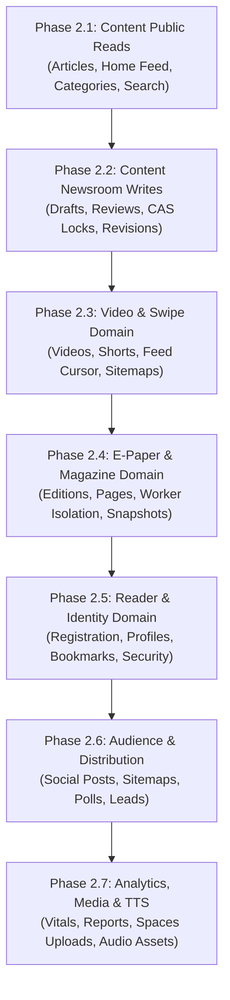

# LokSwami B3 — Phase 2 Implementation Plan
## Phased Modular Monolith Refactoring & Domain Decoupling

> **Parent Audit**: [PHASE2_DOMAIN_BOUNDARY_AUDIT.md](file:///c:/Users/Lenovo/OneDrive/Desktop/Lokswami_V3/Zaid-lokswami/docs/b3/PHASE2_DOMAIN_BOUNDARY_AUDIT.md)
> **Status**: APPROVED EXECUTION ROADMAP
> **Author**: Principal B3 Software Architect

---

## 1. Overview & Architecture Strategy

This implementation plan converts the Phase 2.0 Master Architecture Audit into a sequence of **7 backward-compatible refactoring slices** (Phase 2.1 through Phase 2.7).

At each step, the existing production application remains fully functional, all Phase 1 safety invariants are preserved, reader and CMS UIs are unchanged, and changes are validated by automated test suites before progression.

### Layer Separation Rule
```
HTTP / UI
    ↓
API Route / Controller (app/api/**)
    ↓
Domain Service / Application Service (lib/<domain>/*Service.ts)
    ↓
Repository / Infrastructure Adapter (lib/<domain>/*Repository.ts)
    ↓
MongoDB (Primary) / File Fallback / Upstash Redis / DO Spaces / Workers
```

---

## 2. Master Migration Sequence



---

## 3. Detailed Phase Slices

### Phase 2.1: Content Public Read Domain Boundaries

#### 1. Status: IMPLEMENTED & VERIFIED (Phase 2.1 Complete)
Decoupled all 11 public read endpoints for articles, home feed, categories, cities, and search from direct database queries, establishing pure server-only domain service and repository layers in `lib/server/content/`.

#### 2. Scope & Target Routes Migrated
- `app/api/v1/public/articles/route.ts` (GET public article list)
- `app/api/v1/public/articles/[slug]/route.ts` (GET public article detail)
- `app/api/v1/public/articles/latest/route.ts` (GET latest articles feed alias)
- `app/api/v1/public/home-feed/route.ts` (GET composed multi-domain home feed)
- `app/api/v1/public/breaking/route.ts` (GET breaking news ticker alias)
- `app/api/v1/public/categories/route.ts` (GET public category taxonomy)
- `app/api/v1/public/cities/route.ts` (GET public city taxonomy)
- `app/api/v1/public/search/route.ts` (GET public article search)
- `app/api/articles/latest/route.ts` (Legacy compatibility alias)
- `app/api/articles/[id]/route.ts` (Legacy compatibility alias)
- `app/api/breaking/route.ts` (Legacy compatibility alias)

#### 3. Files Created & Modified
- **NEW**: `lib/server/content/articleTypes.ts` (Public article DTOs, query filters, resolution tokens, legacy feed shapes, breaking models).
- **NEW**: `lib/server/content/articleRepository.ts` (Encapsulates Mongoose `Article.find()`, Mongo availability switching, projections, lean documents, and `articlesFile.ts` file fallback).
- **NEW**: `lib/server/content/publicArticleService.ts` (Public article domain service: lists, details, resolution, related items, latest feed, breaking ticker).
- **NEW**: `lib/server/content/publicTaxonomyService.ts` (Category and city taxonomy queries).
- **NEW**: `lib/server/content/publicHomeFeedService.ts` (Cross-domain composition service coordinating articles, EPaper, and Video readers).
- **NEW**: `tests/content-domain-boundaries.test.ts` (Comprehensive characterization tests for repository and service boundaries).
- **MODIFIED**: `lib/server/publicArticles.ts` (Clean backward-compatible server facade).
- **MODIFIED**: `lib/server/publicTaxonomy.ts` (Clean backward-compatible server facade).
- **MODIFIED**: `lib/server/publicHomeFeed.ts` (Clean backward-compatible server facade).
- **MODIFIED**: The 11 target route handlers to delegate directly to server domain services.

#### 4. Tests & Verification Summary
- **Characterization & Domain Tests**: `tests/content-domain-boundaries.test.ts` (11 tests pass), `tests/public-articles-service.test.ts` (12 tests pass), `tests/public-home-feed-service.test.ts` (3 tests pass).
- **Route Contract Suites**: `tests/api/public-v1-articles-routes.test.ts` (4 tests), `tests/api/public-articles-routes.test.ts` (4 tests), `tests/api/breaking-route.test.ts` (2 tests), `tests/api/public-home-feed-route.test.ts` (1 test), `tests/api/public-v1-taxonomy-routes.test.ts` (2 tests). Total focused: 39 tests passing across 8 files.
- **Phase 1 Regression Suites**: `tests/epaper-release-snapshot-safety.test.ts`, `tests/pdf-render-mutex-safety.test.ts`, `tests/storage-reader-credential-scrub.test.ts`, `tests/video-sitemap-route.test.ts` (31 tests pass).
- **Quality Gates**:
  - `npm run typecheck`: 0 errors.
  - `npm run lint:strict`: 0 warnings, 0 errors.
  - `npm run test:security`: 8 test files, 63 tests pass.
  - `npm run test:governance`: 4 test files, 16 tests pass.
  - `npm run test:four-role-newsroom`: 6 test files, 25 tests pass.
  - `npm run test:ci`: 208 test files, 989 tests pass + auth guards (7 cases) + admin credentials (6 cases).
  - `npm run build:ci`: Production build successful (exit code 0, 172/172 static pages).

#### 5. Definition of Done Met
- Zero raw Mongoose imports, `connectDB()`, or file store access in public article routes.
- Dual-persistence fallback (`isMongoAvailable`) completely encapsulated in repository layer.
- Strict backward compatibility maintained for all public read HTTP JSON contracts.

---

### Phase 2.2: Content Newsroom Writes & Editorial State Machine Decoupling

#### 1. Goal
Decouple administrative article mutations, optimistic concurrency versioning (CAS locks), revision history, audio resolution, and editorial state transitions from monolithic route handlers into a dedicated `EditorialService`, `NewsroomArticleRepository`, and supporting adapters while preserving 100% of existing contracts.

#### 2. Status
`COMPLETE (PASSED)`

#### 3. Scope & Target Routes Refactored
All 8 target administrative routes refactored into thin controllers:
- `app/api/admin/articles/route.ts` (117 lines, down from 899 lines — 87.0% reduction)
- `app/api/admin/articles/[id]/route.ts` (180 lines, down from 2,289 lines — 92.1% reduction)
- `app/api/admin/articles/[id]/lock/route.ts` (104 lines, down from 337 lines — 69.1% reduction)
- `app/api/admin/articles/[id]/revisions/route.ts` (53 lines, down from 132 lines — 59.8% reduction)
- `app/api/admin/articles/[id]/revisions/[revisionId]/restore/route.ts` (71 lines, down from 325 lines — 78.2% reduction)
- `app/api/admin/articles/[id]/activity/route.ts` (43 lines, down from 106 lines — 59.4% reduction)
- `app/api/admin/categories/route.ts` (56 lines, down from 175 lines — 68.0% reduction)
- `app/api/admin/categories/[id]/route.ts` (22 lines, down from 55 lines — 60.0% reduction)

#### 4. Files Created
- `lib/server/content/newsroomArticleTypes.ts` (188 lines): Domain types, CAS errors, revision snapshot definitions, input shapes.
- `lib/server/content/newsroomArticleRepository.ts` (481 lines): Newsroom article dual-persistence (Mongo/file), CAS conditional updates, revisions, assignee resolution.
- `lib/server/content/newsroomArticleValidation.ts` (742 lines): Input normalization, length/readiness validators, breaking-audio gate, list filtering.
- `lib/server/content/editorialService.ts` (778 lines): Newsroom article lifecycle orchestration (create, update, autosave, workflow transitions, fast-publish, delete, side effects).
- `lib/server/content/editorialRevisionService.ts` (207 lines): Revision history retrieval, rollback validation, and restore orchestration.
- `lib/server/content/articleLockRepository.ts` (281 lines): Editorial lock persistence (Mongo/file fallback), acquisition, renewal, takeover, heartbeat.
- `lib/server/content/adminTaxonomyService.ts` (192 lines): Category administration persistence and validation.
- `lib/server/epaper/adminArticleCompat.ts` (379 lines): Narrow compatibility adapter isolating legacy E-Paper story draft mutations without mutating `releasedSnapshot`.
- `tests/api/admin-article-workflow.test.ts` (460 lines): Dedicated characterization and regression tests for workflow transitions, 409 CAS conflicts, breaking-audio gates, and RBAC guards.

#### 5. Quality Gates & Test Verification
- **AST Architecture Assertion**: Zero occurrences of `@/lib/models/Article`, `connectDB`, `mongoose`, `@/lib/storage/articlesFile`, `Article.find*`, `Article.create`, `Article.update*`, `Article.delete*`, `updateStoredArticle`, or `deleteStoredArticle` across all 8 migrated admin routes.
- **Focused Newsroom Tests**: 7 test files, 69 tests pass (100%).
- **Phase 1 & Phase 2.1 Regression Guards**:
  - `tests/content-domain-boundaries.test.ts` (11 tests pass)
  - `tests/epaper-release-snapshot-safety.test.ts` (1 test pass)
  - `tests/pdf-worker-isolation.test.ts` (5 tests pass)
  - `tests/pdf-render-mutex-safety.test.ts` (9 tests pass)
  - `tests/storage-reader-credential-scrub.test.ts` (14 tests pass)
  - `tests/public-articles-service.test.ts` (12 tests pass)
  - `tests/api/public-articles-routes.test.ts` (4 tests pass)
  - `tests/api/public-v1-articles-routes.test.ts` (4 tests pass)
  - `tests/video-sitemap-route.test.ts` (7 tests pass)
  - `tests/api/public-v1-taxonomy-routes.test.ts` (2 tests pass)
  - `tests/reader-credentials-auth.test.ts` (8 tests pass)
- **Official Quality Gates**:
  - `npm run typecheck`: 0 errors.
  - `npm run lint:strict`: 0 warnings, 0 errors across all strict directories.
  - `npm run test:security`: 8 test files, 63 tests pass.
  - `npm run test:governance`: 4 test files, 16 tests pass.
  - `npm run test:four-role-newsroom`: 6 test files, 25 tests pass.
  - `npm run test:ci`: 209 test files, 998 tests pass + auth guards (7 cases) + admin credentials (synthetic 6 cases).
  - `npm run build:ci`: Production build successful (exit code 0, 172/172 static pages).
  - `git diff --check`: 0 whitespace or formatting errors.
  - Runtime data files committed: NONE (`data/*.json` clean).
  - UI/API contracts changed: NONE.
  - Phase 2.3 started: NO.

---

### Phase 2.3: Video & Swipe / Shorts Domain Decoupling

#### 1. Goal
Decouple video catalog management, vertical short-video feed pagination, aspect ratio classification, and video sitemaps into a dedicated `VideoService` and `VideoRepository`.

#### 2. Scope & Target Routes
- `app/api/admin/videos/route.ts`
- `app/api/admin/videos/[id]/route.ts`
- `app/api/admin/videos/[id]/activity/route.ts`
- `app/api/v1/public/videos/route.ts`
- `app/api/v1/public/videos/latest/route.ts`
- `app/api/v1/public/shorts/route.ts`
- `app/api/v1/public/shorts/latest/route.ts`
- `app/api/v1/public/shorts/[slug]/route.ts`
- `app/api/shorts/latest/route.ts` (Legacy alias)
- `app/api/videos/latest/route.ts` (Legacy alias)
- `app/video-sitemap.xml/route.ts`

#### 3. Files to Create & Modify
- **NEW**: `lib/video/videoTypes.ts` (Video DTOs, shorts cursor types, playback metadata).
- **NEW**: `lib/video/videoRepository.ts` (Encapsulates `Video` Mongoose queries and `videosFile.ts` fallback).
- **NEW**: `lib/video/videoService.ts` (Public swipe feed cursor pagination, CMS video curation, sitemap feeder).
- **MODIFY**: Target video routes and `app/video-sitemap.xml/route.ts`.

#### 4. Tests & Characterization Strategy
- **Status**: `EXISTING COVERAGE SUFFICIENT`.
- **Target Suites**:
  - `tests/video-sitemap-route.test.ts` (Asserts Phase 1 invariants: landscape `/main/videos?video=<id>`, shorts `/main/shorts/<slug>`, pagination >50 items).
  - `tests/api/v1-public-shorts.test.ts`
  - `tests/api/v1-public-videos.test.ts`

#### 5. Definition of Done
- Video routes delegate cleanly to `videoService`.
- Sitemaps consume `videoService.getPublicVideoFeedPage(...)`.
- Phase 1 video sitemap URL and pagination invariants remain 100% green.

---

### Phase 2.4: E-Paper & E-Magazine Domain Decoupling

#### 1. Goal
Decouple edition lifecycles, page coordinate hotspots, Hindi OCR suggestion review, story clipping links, background worker dispatch, and immutable `releasedSnapshot` isolation into `EpaperService` and `EpaperRepository`.

#### 2. Scope & Target Routes
- `app/api/admin/epapers/route.ts`
- `app/api/admin/epapers/[id]/route.ts`
- `app/api/admin/epapers/[id]/pages/route.ts`
- `app/api/admin/epapers/[id]/articles/route.ts`
- `app/api/admin/epapers/[id]/articles/[articleId]/release/route.ts`
- `app/api/admin/epapers/[id]/crop-hotspot/route.ts`
- `app/api/admin/epapers/[id]/ocr/route.ts`
- `app/api/admin/epapers/[id]/processing/route.ts`
- `app/api/admin/stories/*`
- `app/api/v1/public/epapers/*`
- `app/api/public/epapers/[id]/pdf/route.ts`

#### 3. Files to Create & Modify
- **NEW**: `lib/epaper/epaperTypes.ts` (Edition, Page, Hotspot, and Clipping DTOs).
- **NEW**: `lib/epaper/epaperRepository.ts` (Encapsulates `EPaper`, `EPaperArticle`, `Story` models & `epapersFile.ts`).
- **NEW**: `lib/epaper/epaperService.ts` (Edition release workflow, hotspot mapping, worker job dispatch).
- **NEW**: `lib/epaper/epaperWorkerAdapter.ts` (Communicates with isolated native PDF and OCR workers).
- **MODIFY**: Target administrative and public E-Paper route handlers.

#### 4. Tests & Characterization Strategy
- **Status**: `EXISTING COVERAGE SUFFICIENT`.
- **Target Suites**:
  - `tests/epaper-release-snapshot-safety.test.ts` (Verifies unreleased draft edits NEVER mutate `releasedSnapshot`).
  - `tests/pdf-render-mutex-safety.test.ts` (Verifies isolated PDF worker anti-wedge and thread recycle).
  - `tests/pdf-worker-isolation.test.ts`
  - `tests/api/admin-epaper-routes.test.ts`

#### 5. Definition of Done
- `app/api/admin/epapers/[id]/route.ts` reduced from 1,012 lines to < 200 lines.
- Immutable `releasedSnapshot` invariant strictly enforced inside `EpaperService`.
- All 24 E-Paper test suites pass cleanly.

---

### Phase 2.5: Reader & Identity Domain Decoupling

#### 1. Goal
Decouple reader registration, session handling, reading preferences, saved bookmarks, and read tracking into `ReaderService` and `ReaderRepository`, preserving the MongoDB-only credential authority invariant.

#### 2. Scope & Target Routes
- `app/api/auth/register/route.ts`
- `app/api/auth/[...nextauth]/route.ts`
- `app/api/user/profile/route.ts`
- `app/api/user/save/route.ts`
- `app/api/user/track/route.ts`

#### 3. Files to Create & Modify
- **NEW**: `lib/reader/readerTypes.ts` (Reader profile, preferences, bookmarks DTOs).
- **NEW**: `lib/reader/readerRepository.ts` (MongoDB credential operations + sanitized non-credential file storage).
- **NEW**: `lib/reader/readerService.ts` (Registration workflow, password mutation, bookmark toggling).
- **MODIFY**: `app/api/auth/register/route.ts`, `app/api/user/profile/route.ts`.

#### 4. Tests & Characterization Strategy
- **Status**: `EXISTING COVERAGE SUFFICIENT`.
- **Target Suites**:
  - `tests/api/auth-registration.test.ts` (Verifies fail-closed Mongo registration).
  - `tests/user-profile-password-fallback.test.ts` (Verifies password mutations fail closed on Mongo outage).
  - `tests/reader-credentials-auth.test.ts`
  - `tests/storage-reader-credential-scrub.test.ts` (Verifies serialized file scrub and zero passwords in fallback).

#### 5. Definition of Done
- Registration and profile routes delegate to `readerService`.
- Zero password hashes or credential fields ever touch file persistence.
- All 9 reader authentication and profile test suites pass.

---

### Phase 2.6: Audience & Distribution Domain Decoupling

#### 1. Goal
Decouple social sharing post generation, XML sitemaps, reader polls, elections results, newsletter subscribers, contact messages, and commercial inquiries into a unified `DistributionService`.

#### 2. Scope & Target Routes
- `app/api/admin/social-posts/*`
- `app/api/admin/polls/*`
- `app/api/admin/contact-messages/*`
- `app/api/admin/elections/*`
- `app/api/subscribe/route.ts`
- `app/api/marketing/lead/route.ts`
- `app/api/advertise/inquiry/route.ts`
- `app/api/careers/apply/route.ts`
- `app/api/contact/route.ts`
- `app/api/poll/*`
- `app/news-sitemap.xml/route.ts`
- `app/sitemap.ts`

#### 3. Files to Create & Modify
- **NEW**: `lib/audience/audienceTypes.ts` (Social post drafts, poll votes, inquiry types).
- **NEW**: `lib/audience/audienceRepository.ts` (Social, subscriber, inquiry models & file fallbacks).
- **NEW**: `lib/audience/distributionService.ts` (Social dispatch, poll voting, sitemap aggregation).
- **MODIFY**: Target administrative and public distribution routes.

#### 4. Tests & Characterization Strategy
- **Status**: `EXISTING COVERAGE SUFFICIENT`.
- **Target Suites**: `tests/api/social-posts-routes.test.ts`, `tests/api/poll-routes.test.ts`, `tests/api/contact-routes.test.ts`.

#### 5. Definition of Done
- Distribution and engagement routes cleanly decoupled from raw storage.
- Sitemaps generate deterministic, validated XML feeds via service layer.
- All 25 audience test suites pass.

---

### Phase 2.7: Analytics, Media Storage & Audio Decoupling

#### 1. Goal
Decouple Core Web Vitals beacon tracking, leadership reporting schedules, DigitalOcean Spaces S3 pre-signed upload generation, and manual TTS audio asset cataloging into dedicated services.

#### 2. Scope & Target Routes
- `app/api/analytics/track/route.ts`
- `app/api/v1/public/analytics/vitals/route.ts`
- `app/api/admin/analytics/*`
- `app/api/admin/settings/leadership-reports/route.ts`
- `app/api/admin/media/*`
- `app/api/admin/upload/route.ts`
- `app/api/admin/uploads/*`
- `app/api/admin/tts/*`

#### 3. Files to Create & Modify
- **NEW**: `lib/analytics/analyticsService.ts` & `lib/analytics/analyticsRepository.ts`.
- **NEW**: `lib/media/mediaService.ts` & `lib/media/spacesAdapter.ts`.
- **NEW**: `lib/audio/ttsService.ts` & `lib/audio/ttsRepository.ts`.
- **MODIFY**: Target analytics, media, and TTS route handlers.

#### 4. Tests & Characterization Strategy
- **Status**: `EXISTING COVERAGE SUFFICIENT`.
- **Target Suites**: `tests/api/analytics-routes.test.ts`, `tests/api/media-upload-routes.test.ts`, `tests/api/tts-routes.test.ts`.

#### 5. Definition of Done
- Real-time analytics SSE streams, report schedulers, and S3 pre-signing completely isolated in domain modules.
- Zero direct AWS SDK or Spaces client instantiation inside HTTP route files.
- Full CI test suite passes (207 test files, >930 tests).

---

## 4. Rollback & Verification Protocol

For each migration slice:
1. **Pre-flight**: Ensure working tree is clean on the phase-specific branch.
2. **Implementation**: Build domain types, repository, and service before modifying route handlers.
3. **Focused Verification**: Run targeted domain tests (`npx vitest run tests/<domain>-*.test.ts`).
4. **Static Analysis**: Run `npm run typecheck` and `npm run lint`.
5. **Full Suite Gate**: Run `npm run test:ci` across all 207 test files.
6. **Production Build Gate**: Run `npm run build:ci` to guarantee zero bundling or SSR breakage.
7. **Rollback Trigger**: If a regression occurs that cannot be resolved within the slice boundary, `git checkout` the slice branch back to the pre-slice commit SHA.

---

## 5. Phase 2 Exit Criteria

Phase 2 is considered complete **only** when:
1. All 154 HTTP route handlers delegate business rules and persistence to pure domain services.
2. Zero Mongoose model queries or `connectDB()` calls remain directly inside `app/api/**` route files.
3. All Phase 1 safety invariants remain 100% green in CI.
4. `npm run test:ci` passes all 207 test suites.
5. `npm run build:ci` succeeds with 0 errors.
6. Documentation is updated to reflect active domain interfaces.
