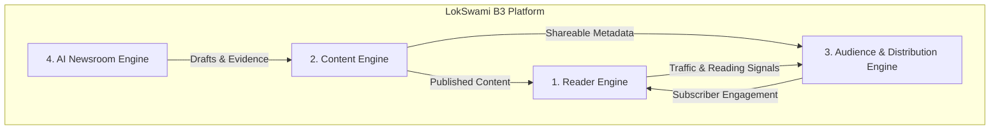

# LokSwami B3 — Product Vision & Strategic Engines

## 1. Executive Summary

LokSwami B3 is the strategic architecture evolution of the LokSwami digital Hindi media platform. 

Rather than executing a risky, greenfield rewrite, B3 systematically evolves the existing production Next.js 15 application into an:
- **AI-Assisted**: Augmenting editorial research, evidence gathering, drafting, headlines, and verification under strict human authority.
- **Reader-First**: Delivering sub-second perceived load times, smooth offline-capable reading (PWA), and rich multimedia consumption.
- **Distribution-First**: Powering viral WhatsApp circulation, dynamic branded Open Graph sharing, daily E-Paper alerts, and subscriber retention.
- **High-Performance**: Rigorously bounded by Core Web Vitals (LCP $\le 2.5$s, INP $\le 200$ms, CLS $\le 0.1$ at p75).
- **Multimedia Digital Newsroom Platform**: Supporting modern formats across interactive E-Paper editions, vertical Swipe short videos, streaming video, and audio/TTS.

---

## 2. The Four Primary Product Engines

LokSwami B3 is organized around four core engines that operate within a disciplined modular monolith:

### Engine 1: Reader Engine
- **Purpose**: Maximize public reading performance, accessibility, engagement, and reader retention across mobile and desktop.
- **Core Capabilities**:
  - Blazing-fast homepage with prioritized editorial rails (*Live Updates* breaking news, *Popular News* trending, regional and topic sections).
  - Clean, typography-first article reading with rich media embeds and inline audio/TTS player.
  - Interactive touch-enabled E-Paper reader with instant page zooming, page thumbnails, and story hotspot clipping modals.
  - Full-screen vertical Swipe / Shorts short-video feed with seamless preloading and swipe transitions.
  - Instant client search, category feeds, offline PWA caching, and bookmarking/saved articles.
- **Status Classification**:
  - `CURRENT FACT`: Reader homepage, article pages, E-Paper viewer, and initial swipe feed exist in `app/(reader)`.
  - `TARGET REQUIREMENT`: Reader LCP $\le 2.5$s, INP $\le 200$ms, CLS $\le 0.1$ at p75; edge caching with stale-while-revalidate; zero render blocking from secondary services.
  - `FUTURE OPTION`: Standalone Flutter mobile application consuming `/api/v1` public APIs.

### Engine 2: Content Engine
- **Purpose**: Power the editorial authoring, workflow governance, multi-format media management, and publication lifecycle.
- **Core Capabilities**:
  - Multi-stage editorial workflow: `Intake → Draft → Desk Review → Copy Edit → Verification → Admin Preview → Published`.
  - Rich text authoring via Tiptap with structured blocks, image credits, SEO checklists, and word/character analytics.
  - Multi-format publication lifecycle: Articles, Breaking News, E-Paper daily editions, E-Paper story clippings, E-Magazine monthly issues, Videos, and Shorts.
  - Article revision history, concurrent editing locks (CAS heartbeats), and desk activity feeds.
  - Dual-persistence architecture: MongoDB Mongoose primary models with verified atomic local file-store fallbacks.
- **Status Classification**:
  - `CURRENT FACT`: 4-role newsroom RBAC (`reporter`, `copy_editor`, `admin`, `super_admin`) implemented; Mongoose schemas and file fallbacks exist.
  - `TARGET REQUIREMENT`: Strict server-side publication state transitions; zero leakage of draft/scheduled content to reader feeds; atomic E-Paper release snapshots.
  - `FUTURE OPTION`: Granular revision diff viewer in CMS; automated collaborative editing locks across multiple newsroom desks.

### Engine 3: Audience & Distribution Engine
- **Purpose**: Transform anonymous traffic into loyal, registered readers through omni-channel distribution and retention loops.
- **Core Capabilities**:
  - High-impact social distribution: stable public URLs, dynamic server-rendered Open Graph / Twitter cards with branded banner generation, and WhatsApp-optimized preview snippets.
  - Reader identity and preference management: localized city editions, category interests, notification preferences, and explicit consent records.
  - Scheduled, automated distribution: daily E-Paper morning WhatsApp dispatch, push alerts for breaking news, and newsletter digestion.
  - Attribution tracking, campaign UTM tracking, reader engagement telemetry, and readership diagnostics.
- **Status Classification**:
  - `CURRENT FACT`: Dynamic OG image route exists (`/api/og`); NextAuth credentials and Google OAuth sign-in exist; basic user models exist.
  - `TARGET REQUIREMENT`: Asynchronous distribution worker queue; WhatsApp delivery status tracking; distribution failure must never block editorial publication.
  - `UNKNOWN / NEEDS DECISION`: Choice of official WhatsApp Business Cloud API provider (direct Meta Cloud API vs. BSP such as Gupshup, Wati, or Twilio).

### Engine 4: AI Newsroom Engine
- **Purpose**: Exponentially increase newsroom productivity and reporting depth while preserving strict human editorial authority.
- **Core Capabilities**:
  - Provider-neutral AI orchestrator supporting Gemini, OpenAI, Anthropic, and future open-source models via a unified adapter.
  - Story intake, multi-source research, evidence collection, and fact verification.
  - First-draft generation, headline variations, copy-editing polish, and SEO optimization.
  - Media summarization and translation assistance.
  - **Absolute Human Authority**: AI never auto-publishes journalism by default. All AI outputs are staged as suggestions or drafts for human editor sign-off.
- **Status Classification**:
  - `CURRENT FACT`: Gemini API (`gemini-2.5-flash`) is used for translation assistance; basic extractive heuristic summarizer exists.
  - `TARGET REQUIREMENT`: Orchestrated asynchronous multi-stage AI jobs with dedicated job states, progress reporting, and evidence record packaging.
  - `FUTURE OPTION`: Multi-model benchmarking and routing (e.g., Anthropic for complex policy analysis, Gemini for multimodal speed).

---

## 3. Product Principles

1. **Preserve What Works**: The current LokSwami reader design, CMS navigation, and operational muscle represent real engineering value. Evolve; do not destroy.
2. **Performance Is a Feature**: Slow news sites lose readers. Every architecture decision must be weighed against Core Web Vitals.
3. **Distribution Is King**: An article read by 50 people on the site is 10x more valuable if shared to 5,000 readers via WhatsApp. Sharing is a core engineering system.
4. **Editorial Integrity Over Speed**: Automation must never compromise factual accuracy. Evidence before assertions; human before publication.
