# LokSwami B3 — Phased Architecture & Implementation Roadmap

## Overview

The LokSwami B3 roadmap is structured into controlled, backward-compatible slices. At each phase, the existing production application remains fully operational, the reader/CMS UI is preserved, and changes are validated by automated test suites before progression.

---

## The 11 Implementation Phases

```mermaid
graph LR
    P0["Phase 0: Baseline"] --> P1["Phase 1: Boundaries"]
    P1 --> P2["Phase 2: API v1"]
    P2 --> P3["Phase 3: Observability"]
    P3 --> P4["Phase 4: Reader Perf"]
    P4 --> P5["Phase 5: Sharing"]
    P5 --> P6["Phase 6: Jobs & Queues"]
    P6 --> P7["Phase 7: E-Paper Workers"]
    P7 --> P8["Phase 8: AI Newsroom"]
    P8 --> P9["Phase 9: Distribution"]
    P9 --> P10["Phase 10: Video/Swipe"]
    P10 --> P11["Phase 11: Measured Extraction"]
```

| Phase | Strategic Focus | Target Deliverables & Safeguards | UI Impact |
| :--- | :--- | :--- | :--- |
| **Phase 0** | **Baseline Certification** | Validate test suite (`npm run test:ci`), lint, typecheck, production build (`npm run build:ci`), and capture performance baseline numbers. | No change |
| **Phase 1** | **Domain Boundaries** | Decouple direct DB queries from Next.js route handlers into pure domain service functions (`lib/content`, `lib/server`). | No change |
| **Phase 2** | **API v1 Contracts** | Complete and standardize the public contract under `/api/v1/public/*` for web, PWA, and future native mobile apps. | No change |
| **Phase 3** | **Observability Foundation** | Implement end-to-end request correlation IDs (`x-request-id`), structured logging, and route performance timers. | Invisible to reader |
| **Phase 4** | **Reader Performance & Caching** | Optimize Core Web Vitals (LCP $\le 2.5$s, INP $\le 200$ms, CLS $\le 0.1$), image priority loading, responsive sizing, and edge cache headers. | Same UI, substantially faster |
| **Phase 5** | **Unified Sharing & Previews** | Build unified dynamic branded Open Graph generator (1200x630px) and optimize WhatsApp teaser cards for articles, E-Paper, and videos. | High-quality social previews |
| **Phase 6** | **Asynchronous Job Foundation** | Establish Redis/DB-backed queue abstraction (`JobModel`, worker loops, retry backoffs, distributed locks). | Backend foundation |
| **Phase 7** | **E-Paper Worker Isolation** | Offload CPU-heavy PDF page slicing and local Hindi OCR into dedicated background workers, freeing the web process. | CMS upload is instantaneous |
| **Phase 8** | **AI Newsroom Foundation** | Implement asynchronous multi-agent research pipeline, Evidence Package schemas, and CMS AI review workbench. | New CMS capability; strict human publishing gate |
| **Phase 9** | **Audience & Distribution Engine** | Implement asynchronous WhatsApp and web push notification broadcast workers with rate limiting and opt-out support. | Automated reader re-engagement |
| **Phase 10** | **Video & Swipe Optimization** | Optimize vertical short-video feed with incremental cursor pagination and 4-video memory window `[prev, CURR, next, next+1]`. | Smoother playback, reduced mobile memory |
| **Phase 11** | **Load Testing & Measured Extraction** | Run stress tests (`scripts/load-test-public.js`); evaluate bottlenecks; extract standalone services only where justified by metrics. | Measured architecture evolution |

---

## Phase Signoff Criteria

A phase is considered complete **only** when:
1. All focused and CI tests pass (`npm run test:ci`).
2. TypeScript compilation passes without errors (`npm run typecheck`).
3. Strict linting passes (`npm run lint`).
4. Production build passes (`npm run build:ci`).
5. No regressions in authentication, authorization, or publication visibility.
6. Documentation is updated to reflect all architectural additions.
