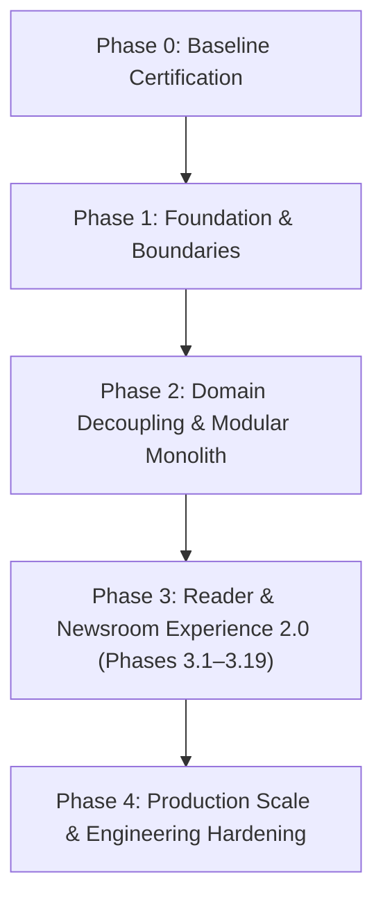

# LokSwami B3 — Phased Architecture & Implementation Roadmap

## 1. Overview

The LokSwami B3 roadmap defines the long-term architecture, engineering governance, and product evolution of the platform. Following the completion of Phase 2 (Modular Monolith Domain Decoupling), the system operates as an encapsulated modular monolith with strict domain boundaries, certified safety invariants, and comprehensive test coverage.

Development progresses through disciplined, sequential phases. At every phase:
- The modular monolith architecture is strictly preserved.
- Safety, security, and editorial invariants remain non-negotiable.
- Automated quality gates must pass before any phase transitions.
- External service or infrastructure extractions are considered only when justified by production telemetry.
- Current live production (`lokswami.com`) remains completely untouched until the approved cutover phase.

---

## 2. High-Level Master Roadmap

| Phase | Strategic Focus | Primary Deliverables & Objectives | Architecture & Safety Invariants |
| :--- | :--- | :--- | :--- |
| **Phase 0** | **Baseline Certification** | Validate test suites (`test:ci`), linting, typecheck, and baseline performance. | Verified baseline; no code changes. |
| **Phase 1** | **Foundation & Boundaries** | Establish safety invariants (reader auth fail-closed, PDF mutex, sitemap safety). | Invariants enforced by automated gates. |
| **Phase 2** | **Domain Decoupling** | Refactor all 7 domain slices into pure controllers, services, and repositories. | Modular monolith; zero raw DB in controllers. |
| **Phase 3** | **Reader & Newsroom Experience 2.0** | Comprehensive UX/UI revamp, design system, CMS audit & staging foundation, hardened RBAC, editorial workflows, reader surfaces 2.0, universal sharing, and controlled cutover (Phases 3.1–3.19). | Modular monolith preserved; strict environment separation; zero production impact until cutover. |
| **Phase 4** | **Production Scale & Hardening** | Follows Phase 3 production cutover; deeper engineering hardening, scaling, dependency/security debt reduction, and post-production optimization. | Post-cutover engineering; zero unverified services. |

---

## 3. Phase 3 — Reader & Newsroom Experience 2.0 (Canonical Sequence)

### Strategic Goal
Transform LokSwami into a visually stunning, highly engaging, brand-consistent digital news platform with a robust, production-grade CMS newsroom, strict role-based access control, universal content shareability, and a controlled, zero-downtime production cutover.

### Canonical Phase 3 Sequence (Phases 3.1 through 3.19)

| Sub-Phase | Workstream Title | Status | Scope & Deliverables |
| :--- | :--- | :--- | :--- |
| **3.1** | **Reader UX / Product Audit** | **COMPLETE** | Comprehensive audit of all reader touchpoints, typography readability, mobile friction points, Hindi/English typography metrics, and navigation drop-offs. Completed as foundation baseline. |
| **3.2** | **Design System** | **COMPLETE** | Unified tokenized design system (color palette, typography scale, dark/light contrast, iconography, component library, UI primitives). Completed as foundation baseline. |
| **3.3** | **Global Reader Shell & Navigation** | **COMPLETE** | Modern header/footer, sticky category bar, breaking news marquee, drawer navigation, search overlay. Completed and refined with approved responsive-header implementation (`Header.tsx` compact ~34×44px geometry at 390–639px expanding to $\ge 44\times 44$px at 640px+). |
| **3.4** | **CMS Audit + Staging / Preview Foundation** | **READY TO START** | Comprehensive audit and preparation before CMS implementation: current CMS inventory, current RBAC inventory, staging environment architecture, Vercel Preview foundation, dedicated staging DB/auth/storage policy, strict environment separation, outbound integrations disabled/sandboxed, Election and Ads permission gap discovery. **Invariant**: No main runtime RBAC migration yet; discovery and staging policy only. |
| **3.5** | **CMS Shell / Auth / RBAC Hardening** | PENDING | Implementation of approved role-based Super-Admin control-plane policy: menu/sidebar permissions, route authorization, API endpoint authorization, domain permission helpers, and four-role test coverage (`super_admin`, `admin`, `copy_editor`, `reporter`). |
| **3.6** | **CMS Dashboard + Newsroom Work Management** | PENDING | CMS editorial dashboard, newsroom work management, my work / assignment tracking, workflow queue visibility, activity feeds, and operational status views. |
| **3.7** | **Articles + Stories + Copy Desk / Editorial Lifecycle** | PENDING | Complete article and story authoring, canonical 12-state editorial lifecycle (`draft`, `submitted`, `assigned`, `in_review`, `copy_edit`, `changes_requested`, `ready_for_approval`, `approved`, `scheduled`, `published`, `rejected`, `archived`), copy desk editing and scoped review transitions, editorial approval, and publication workflows. |
| **3.8** | **Video + Media + Social + Push Distribution** | PENDING | Video and media management in CMS, social media draft staging, push notification authoring and dispatch controls (strictly human-gated), and media asset library management. |
| **3.9** | **E-Paper CMS Workflow** | PENDING | E-Paper daily issue creation, page upload, metadata management, PDF processing, edition assignment, interactive hotspot mapping, and clipping workflow. **Important**: Approved future direction is full E-Paper lifecycle under Super Admin, subject to separately approved RBAC implementation. |
| **3.10** | **Admin / System Control Panels** | PENDING | Owner-control and system administration panels: Team management, Users & Subscribers, Newsroom Settings, AI Ops, Core Analytics, Reader Polls, Operations Center & Diagnostics, Revenue / Ads, Business Value Analytics, Security Audit Logs, Permission Review & Auditing, and Election platform controls (infrastructure, tally APIs, live widgets). |
| **3.11** | **Homepage 2.0** | PENDING | Transformed public reader homepage, editorial rails (Breaking Stories in Live Updates, Trending in Popular News, with mandatory backfill from published articles), section grids, featured lead stories, interactive polling widgets, and rich multimedia integration. |
| **3.12** | **Article Reader 2.0** | PENDING | Clean editorial reading layout, reading progress bar, inline audio player for manual TTS, related stories grid, responsive bilingual typography (Devanagari matra preservation, zero vertical clipping). |
| **3.13** | **Deep Links + Universal Share + OG / Social Preview** | PENDING | Standardized canonical URL routing engine across all content types with redirect resolution for legacy slugs, unified sharing sheet (WhatsApp, Telegram, X, Facebook, LinkedIn, Email, Native Web Share, Copy Link), dynamic edge-generated social cards (1200×630px) embedding story title, category badge, publication date, and LokSwami logo, and high-CTR teaser cards formatted specifically for WhatsApp messaging previews. |
| **3.14** | **Video Hub 2.0 + Shorts / Swipe 2.0** | PENDING | Premium horizontal video portal, responsive 16:9 player, category playlists, theater mode, autoplay controls, and full-screen 9:16 vertical short-video experience with smooth gestures, memory-efficient feed pooling, and related article links. |
| **3.15** | **E-Paper Reader + E-Magazine + Hotspots + Exact Story Sharing** | PENDING | High-performance daily edition reader, smooth zoom/pan canvas, thumbnail drawer, edition selector, date archive navigator, realistic page-turn flipbook reader for monthly digital magazines, visual hotspot overlays on newspaper pages, interactive clipping highlights, and granular deep linking: Exact Edition $\rightarrow$ Exact Page $\rightarrow$ Exact Story Highlight / Modal. |
| **3.16** | **Mobile UX Hardening** | PENDING | Bottom navigation bar, pull-to-refresh, touch-friendly tap targets ($\ge 44$px default, documented header exception preserved), mobile CMS usability and responsive administration views, PWA offline caching, and layout stability. |
| **3.17** | **Accessibility Hardening (Reader + CMS)** | PENDING | WCAG 2.1 AA compliance across Reader and CMS surfaces, full screen-reader support, semantic landmarks, high-contrast mode, accessible focus rings, and focus trapping/restoration in modals and drawers. |
| **3.18** | **Performance + Analytics + Full CMS UAT + Migration Rehearsal / Staging Soak** | PENDING | Core Web Vitals optimization (LCP $\le$ 2.5s, INP $\le$ 200ms, CLS $\le$ 0.1), privacy-safe share & engagement telemetry, end-to-end device testing matrix (iOS Safari, Android Chrome, Desktop Firefox/Chrome/Edge, tablet form factors), full CMS user acceptance testing (UAT) across all 4 newsroom roles, migration rehearsal, and prolonged staging soak. |
| **3.19** | **Production Reader + CMS Cutover** | PENDING | Final data migration and verification, production environment provisioning and validation, DNS / domain cutover from legacy system, live production monitoring and telemetry verification, rollback plan, and rapid recovery protocols. **Invariant**: Current live `lokswami.com` remains completely untouched until this phase. |

---

## 4. Phase 4 & Post-Cutover Evolution

> [!NOTE]
> **High-Level Post-Cutover Scope Only**
> No formal numbered Phase 4 sub-workstreams are defined in this roadmap. Detailed workstreams will be formulated after Phase 3 production cutover is complete and verified.

Phase 4 follows Phase 3 production cutover and may include:
- Deeper engineering hardening and infrastructure resilience.
- Production capacity scaling and distributed caching (Redis / CDN edge tuning).
- Dependency security debt reduction (systematic remediation of legacy npm advisory findings cataloged under DEBT-010).
- Post-production performance optimization based on real-world reader telemetry.

Subsequent long-term strategic directions (such as audience distribution automation, assistive AI newsroom tools, monetization systems, and dedicated native mobile applications) will be sequenced under separate owner-approved milestones following Phase 4 stabilization.

---

## 5. Roadmap Principles & Operational Governance

All B3 phases operate under strict engineering principles and automated governance:

1. **Disciplined Environment Progression**:
   $$\text{LOCAL} \longrightarrow \text{VERCEL PREVIEW / STAGING} \longrightarrow \text{PRODUCTION}$$
   - **Local**: Development authoring, offline fixtures, test databases, and Fast Loop verification.
   - **Preview / Staging**: Pull request previews, dedicated staging MongoDB, sandboxed integrations, mock outbound channels.
   - **Production**: Live reader-facing traffic. Remains completely untouched until Phase 3.19 cutover.
2. **Human Editorial Authority Invariant**:
   - Human editor/admin retains ultimate publication authority.
   - AI tools are strictly assistive (drafting, summarization, research, headline suggestions).
   - AI **never autonomously publishes** journalism or dispatches notifications.
3. **Agent PR Safety Invariant**:
   - Automated coding agents (Codex, Antigravity, etc.) are **strictly forbidden from merging pull requests**.
   - Agents author code, run verification, push branches, and report status; merge actions require explicit human owner authorization.
4. **Development Accelerator Workflow**:
   - Every phase utilizes the canonical B3 Development Accelerator workflow.
   - **Fast Loop**: Scoped changes with focused unit tests and typechecks during active authoring.
   - **Full Verification**: Complete test suite (`npm run verify:phase3` or phase-equivalent) executed only when the candidate branch is stable.
   - **Exact-Head CI**: All pull requests must pass fresh exact-head GitHub Actions CI.
   - **Zero Unresolved Threads**: All review threads must be resolved before PR readiness is certified.
   - **Explicit Owner Authorization**: Final signoff and merge require explicit product owner authorization.

---

## 6. RBAC Architecture: Current Runtime vs. Approved Future Direction vs. Implementation Phase

To prevent governance confusion, the platform strictly distinguishes between current active runtime permissions, the approved future architectural direction, and the scheduled implementation phase:

### A. Current Runtime Permissions (Active Today)
- **Source of Truth**: Governed authoritatively by executable code in `lib/auth/permissions.ts`, `lib/auth/roles.ts`, and verified by `tests/permissions-governance.test.ts`.
- **Four-Role Model**:
  - `super_admin`: Platform owner with explicit access to 38 of 39 canonical pages (`my_work` denied).
  - `admin`: Full operational management across articles, media, polls, categories, cities, authors, and newsroom workflows.
  - `copy_editor`: Scoped editorial review; may draft direct articles and perform assigned workflow transitions; **strictly prohibited** from approving, rejecting, scheduling, publishing, or fast-publishing.
  - `reporter`: Content creation; may draft and submit own stories; cannot approve, schedule, or publish.
- **Rules**: Executable permissions remain authoritative until modified by an approved implementation PR.

### B. Approved Future Direction (Owner-Control Plane Model)
- **Architectural Proposal**: Detailed in `docs/b3/PHASE3_RBAC_POLICY.md`.
- **Core Principle**: Role-based Super-Admin control plane. High-stakes, system-wide, and revenue-impacting capabilities represent the approved future direction for Super-Admin-only control, scheduled for runtime implementation in Phase 3.5:
  - E-Paper complete lifecycle (creation, editing, hotspot mapping, preparation, publishing, deletion).
  - Identity & Staff Governance (team invitations, role assignment, subscriber management).
  - System Operations (Newsroom Settings, Operations Center, Diagnostics, Audit Logs).
  - Revenue & Commercial Controls (Ads, monetization reports, business value analytics, reader polls).
  - AI Infrastructure (Global AI Ops, API keys, rate limits, model selection).
  - Election Platform Controls (real-time election tally APIs, live result banners, widget infrastructure).
- **Anti-Pattern Guard**: Zero hardcoding of personal emails or individual users; access is governed strictly by the `super_admin` role.

### C. Implementation Phase
- **Scheduled Milestone**: The approved Super-Admin control-plane policy is scheduled for implementation in **Phase 3.5** (CMS Shell / Auth / RBAC Hardening).
- **Preceding Discovery**: Phase 3.4 conducts the comprehensive CMS and RBAC inventory and identifies permission gaps (e.g., Election/Ads controls) without mutating active runtime authorization.
- **Integrity Guarantee**: Zero runtime RBAC permissions are modified in Phase 3.1 through 3.4.

---

## 7. Phase Signoff & Promotion Criteria

A roadmap phase is officially signed off and approved for progression **only** when all of the following gates pass:
1. **Automated Unit & Integration Tests**: Full Vitest suite passes with 100% green status (`npm run test:ci`).
2. **Static Type Safety**: TypeScript compilation passes with zero errors (`npm run typecheck`).
3. **Strict Code Quality & Governance**: Strict ESLint passes with zero warnings (`npm run lint:strict`), and architectural governance tests pass (`npm run test:governance`).
4. **Security & Invariants**: Security suite passes (`npm run test:security`), Four-Role Newsroom RBAC suite passes (`npm run test:four-role-newsroom`), and dependency security floor passes (`npm run verify:dependency-security`).
5. **Production Compilation**: Clean production build with zero errors (`npm run build:ci`).
6. **Zero Invariant Regressions**: Reader credentials remain fail-closed, released snapshots remain isolated, and human publishing authority remains non-negotiable.
7. **Documentation Sync**: Architectural documentation, debt registers, and API specs are fully synchronized with runtime reality.
