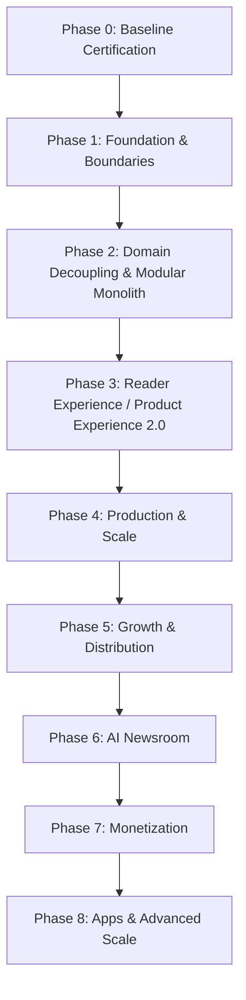

# LokSwami B3 — Phased Architecture & Implementation Roadmap

## 1. Overview

The LokSwami B3 roadmap defines the long-term architecture and product evolution of the platform. Following the completion of Phase 2 (Modular Monolith Domain Decoupling), the system operates as an encapsulated modular monolith with strict domain boundaries, certified safety invariants, and comprehensive test coverage.

Post-Phase-2 development progresses through six focused, sequential phases (Phases 3 through 8). At every phase:
- The modular monolith architecture is preserved.
- Safety and editorial invariants remain non-negotiable.
- Automated quality gates must pass before any phase transitions.
- External services or infrastructure extraction are only considered when justified by production telemetry.

---

## 2. High-Level Master Roadmap

| Phase | Strategic Focus | Primary Deliverables & Objectives | Architecture & Safety Invariants |
| :--- | :--- | :--- | :--- |
| **Phase 0** | **Baseline Certification** | Validate test suites (`test:ci`), linting, typecheck, and baseline performance. | Verified baseline; no code changes. |
| **Phase 1** | **Foundation & Boundaries** | Establish safety invariants (reader auth fail-closed, PDF mutex, sitemap safety). | Invariants enforced by automated gates. |
| **Phase 2** | **Domain Decoupling** | Refactor all 7 domain slices into pure controllers, services, and repositories. | Modular monolith; zero raw DB in controllers. |
| **Phase 3** | **Reader Experience 2.0** | Comprehensive UX/UI revamp, design system, deep linking, universal share system, branded OG previews. | Front-end & UX transformation; zero backend contract regressions. |
| **Phase 4** | **Production & Scale** | Observability, structured logging, Redis/CDN caching, durable queues, backup/recovery, dependency security remediation. | Production hardening; zero microservices. |
| **Phase 5** | **Growth & Distribution** | WhatsApp broadcasts, push notifications, newsletter automation, social distribution, breaking alerts. | Human publishing gate; asynchronous workers. |
| **Phase 6** | **AI Newsroom** | Human-controlled AI research, drafting, summarization, translation, and SEO assistants. | Zero autonomous publishing; human editorial gate intact. |
| **Phase 7** | **Monetization** | Advertising engine, campaign tooling, sponsored content, local business leads, subscriptions. | Strict separation of editorial and commercial concerns. |
| **Phase 8** | **Apps & Advanced Scale** | Native Android & iOS apps, mobile push, offline reading, personalization, measured extraction. | Service extraction only when justified by metrics. |

---

## 3. Phase 3 — Reader Experience / Product Experience 2.0

### Strategic Goal
Transform LokSwami into a visually stunning, highly engaging, brand-consistent digital news product with world-class usability, universal shareability, and deep content linking across all media formats.

### Core Product Requirements for Shareable Content
Every piece of published content—including **Articles**, **Videos**, **Shorts / Swipe**, **E-Paper Editions**, **E-Paper Pages / Stories**, and **E-Magazines**—must support:
1. **Canonical Deep Links**: Permanent, deterministic URLs that resolve cleanly across web, mobile, and social platforms.
2. **Brand-Consistent Previews**: Dynamic Open Graph / Twitter cards featuring the LokSwami brand identity, official logo, verified badges, and publication styling.
3. **Accurate Metadata**: Crisp typography, correct localized headlines, Hindi/English excerpts, and high-fidelity lead images.
4. **WhatsApp-Optimized Share Cards**: High-CTR teaser cards formatted specifically for WhatsApp messaging previews.
5. **Native Sharing & Quick Actions**: 1-tap WhatsApp share, Web Share API integration, copy link with clipboard feedback, and social channel dispatch.
6. **E-Paper Granular Deep Linking**: A recipient opening a shared E-Paper clipping must navigate seamlessly:
   $$\text{Exact Edition} \longrightarrow \text{Exact Page} \longrightarrow \text{Exact Story Highlight / Modal}$$

### Phase 3 Sub-Phases & Workstreams

| Workstream | Sub-Phase | Scope & Deliverables |
| :--- | :--- | :--- |
| **3.1** | **UX Audit** | Comprehensive audit of all reader touchpoints, typography readability, mobile friction points, and navigation drop-offs. |
| **3.2** | **LokSwami Design System** | Unified tokenized design system (color palette, typography scale, dark/light contrast, iconography, component library). |
| **3.3** | **Global Navigation & Reader Shell** | Modern header/footer, sticky category bar, breaking news marquee, drawer navigation, search overlay. |
| **3.4** | **Article Reader 2.0** | Clean editorial layout, reading progress bar, inline audio player for manual TTS, related stories grid, responsive typography. |
| **3.5** | **Content Deep Linking** | Standardized canonical URL routing engine across all content types with redirect resolution for legacy slugs. |
| **3.6** | **Universal Share System** | Unified sharing sheet (WhatsApp, Telegram, X, Facebook, LinkedIn, Email, Native Web Share, Copy Link with toast). |
| **3.7** | **Branded Open Graph & Social Preview Engine** | Dynamic edge-generated social cards (1200x630px) embedding story title, category badge, publication date, and LokSwami logo. |
| **3.8** | **Video Hub 2.0** | Premium horizontal video portal, responsive 16:9 player, category playlists, theater mode, autoplay controls. |
| **3.9** | **Shorts / Swipe 2.0** | Full-screen 9:16 vertical short-video experience with smooth gestures, memory-efficient feed pooling, and related article links. |
| **3.10** | **E-Paper Reader 2.0** | High-performance edition reader, smooth zoom/pan canvas, thumbnail drawer, edition selector, date archive navigator. |
| **3.11** | **E-Magazine Book Experience** | Realistic page-turn flipbook reader for digital magazines with dual-page landscape view and table of contents. |
| **3.12** | **E-Paper Interactive Story Hotspots** | Visual hotspot overlays on newspaper pages, hover/tap detection, interactive clipping highlights. |
| **3.13** | **E-Paper Story Deep Links** | Direct URL addressing for individual clipped stories within an edition (`/epaper/:editionId/:pageNumber#story-:storyId`). |
| **3.14** | **Mobile UX Optimization** | Bottom navigation bar, pull-to-refresh, touch-friendly tap targets ($\ge 48$px), haptic feedback, PWA offline caching. |
| **3.15** | **Accessibility (a11y)** | WCAG 2.1 AA compliance, full screen-reader support, semantic landmarks, high-contrast mode, accessible focus rings. |
| **3.16** | **Performance UX** | Instant page transitions, skeleton loaders, layout stability (CLS $\le 0.05$), priority hero image loading. |
| **3.17** | **Share & Engagement Analytics** | Privacy-safe telemetry tracking share channel distribution, clipping views, reading depth, and dwell time. |
| **3.18** | **Cross-Device UX QA** | End-to-end device testing matrix (iOS Safari, Android Chrome, Desktop Firefox/Chrome/Edge, tablet form factors). |

---

## 4. Phase 4 — Production & Scale

### Strategic Goal
Harden the modular monolith for massive concurrent production traffic, rock-solid operational reliability, and proactive system observability.

### Scope & Key Deliverables
1. **End-to-End Observability**: Request correlation IDs (`x-request-id`) threaded across all routes, structured JSON logging, distributed tracing (OpenTelemetry), and health dashboards.
2. **Performance Measurement & Telemetry**: Continuous real-user Core Web Vitals (CWV) collection, automated p75/p99 latency alerting, and route performance timers.
3. **Caching & CDN Hardening**: Edge cache purge hooks (Cloudflare/Fastly API integration), stale-while-revalidate optimization, and Redis-backed cache layers.
4. **Database & Index Optimization**: Index review for MongoDB collections, query explain plan analysis, slow query monitoring, and connection pooling tuning.
5. **Durable Asynchronous Background Jobs**: Redis-backed distributed queue engine (BullMQ) with automated retries, exponential backoff, and dead-letter queues for CPU-heavy tasks (PDF slicing, OCR, batch dispatches).
6. **Deployment & Staging Infrastructure**: Automated staging environments, zero-downtime blue-green deployments, health check gates, and rollback automation.
7. **Backup & Disaster Recovery**: Automated multi-region database snapshot validation, automated point-in-time recovery (PITR) verification drills, and file backup synchronization.
8. **Security Hardening & Dependency Remediation**: Controlled triage and remediation of all 35 dependency advisory findings (`npm audit`), updating transitive dependency chains, and tightening security lint rules.
9. **Production Load Testing**: Automated stress testing harness (`scripts/load-test-public.js`) simulating high-concurrency breaking news traffic spikes.

---

## 5. Phase 5 — Growth & Distribution

### Strategic Goal
Build modern audience engagement, distribution pipelines, and automated reader acquisition channels without compromising human editorial control.

### Scope & Key Deliverables
1. **WhatsApp Broadcast Automation**: Automated, templated broadcast delivery of breaking news and daily digests to subscriber lists via WhatsApp Business API.
2. **Web Push Notifications**: Standard Web Push API implementation with category-level opt-in, delivery rate-limiting, and rich notification cards.
3. **Newsletter Automation**: Scheduled daily/weekly newsletter composition, subscriber list management, bounce handling, and automated dispatch.
4. **Social Distribution Engine**: Multi-platform scheduled dispatch (Facebook, X, LinkedIn, Telegram) for approved newsroom social drafts.
5. **Breaking News Alert System**: Low-latency multi-channel alert dispatch triggered exclusively by editorial admin action.
6. **SEO Automation**: Structured JSON-LD schema generation (NewsArticle, VideoObject, BreadcrumbList), automated sitemap indexing pings, and AMP compatibility where required.
7. **Audience Segmentation**: Privacy-preserving reader interest clustering based on category reading frequency and region preferences.
8. **Growth Analytics Dashboards**: Centralized metrics on subscriber acquisition, channel conversion rates, notification click-throughs, and newsletter open rates.

---

## 6. Phase 6 — AI Newsroom

### Strategic Goal
Empower human journalists and copy editors with intelligent, assistive editorial tooling to accelerate research, drafting, translation, and packaging—with a strict human-in-the-loop guarantee.

### Core Architectural Invariant
> [!IMPORTANT]
> **Zero Autonomous Publishing Invariant**: AI models are assistive tools. Under no circumstances may an AI system autonomously create, edit, or publish public content or dispatch social messages without explicit authenticated human review and approval.

### Scope & Key Deliverables
1. **Research & Source Synthesis**: Assistive background research workbench aggregating verified public sources, archives, and background context.
2. **Draft & Expansion Assistance**: Reporter drafting workbench offering structure suggestions, section outlining, and lead paragraph brainstorming.
3. **Headline & SEO Generator**: Suggestive title alternatives optimized for clarity, engagement, and search discoverability.
4. **Article Summarization**: Automatic generation of 3-bullet executive summaries and TL;DR snippets for reader convenience.
5. **Bilingual Translation Assistance**: High-fidelity English $\leftrightarrow$ Hindi translation workbench using domain-tuned LLM prompts with side-by-side diff review.
6. **Fact-Checking & Verification Support**: Entity extraction and cross-referencing against internal archives and verified primary sources.
7. **Video Scripts & Social Copy Generation**: Transforming published stories into draft vertical video scripts and platform-tailored social drafts.
8. **Editorial Analytics Insights**: AI-assisted summaries of content performance, audience engagement trends, and coverage gap identification.

---

## 7. Phase 7 — Monetization

### Strategic Goal
Establish sustainable, high-yield digital revenue streams while maintaining exceptional reader experience, fast page load speeds, and strict separation between editorial content and commercial interests.

### Scope & Key Deliverables
1. **Direct Digital Advertising**: Self-serve and direct-sold ad inventory manager supporting standard IAB display formats and native feed placements.
2. **Sponsored Content & Native Stories**: Clearly labeled native storytelling framework with distinct visual treatment, transparency badges, and `rel="sponsored"` enforcement.
3. **Ad Inventory & Placement Engine**: Dynamic ad slot injection with CLS prevention (pre-reserved aspect ratio boxes) and viewability tracking.
4. **Local Advertiser Tooling**: Self-service portal for regional businesses to book classifieds, display ads, and local directory listings.
5. **Commercial Lead Generation**: Managed B2B inquiry capture and routing for real estate, education, automotive, and retail advertisers.
6. **Premium Products & Special Editions**: Paywalled or gated access to exclusive deep-dive investigative reports, commemorative editions, and archive access.
7. **Reader Memberships & Subscriptions**: Tiered reader patronage plans (ad-free browsing, exclusive newsletters, early E-Paper access).
8. **Revenue Analytics & Reporting**: Unified dashboard displaying eCPM, fill rates, sponsor campaign deliverables, subscription MRR, and churn rates.

---

## 8. Phase 8 — Apps & Advanced Scale

### Strategic Goal
Extend LokSwami into dedicated native mobile applications and deploy advanced distributed architecture patterns strictly when demanded by massive scale.

### Scope & Key Deliverables
1. **Native Mobile Applications**: High-performance iOS and Android applications built on clean API v1 contracts.
2. **Mobile Deep Linking (Universal Links / App Links)**: Seamless routing from shared web links into native mobile reading views.
3. **Mobile Push Notification Services**: Rich native push notifications with deep action buttons, breaking badges, and quiet hours.
4. **Offline Reading Mode**: Background prefetching and encrypted local SQLite storage of daily editions and saved articles for offline commuting.
5. **Personalization & On-Device Recommendations**: Privacy-preserving content recommendations based on localized reading habits.
6. **Advanced Multilingual Search**: Vector-based semantic search across articles, video transcripts, and OCR-scanned E-Paper archives.
7. **Real-Time Architecture**: WebSocket-based live election tally updates, live cricket scores, and breaking event liveblogs.
8. **Measured Service Extraction**: Independent microservice extraction (e.g., dedicated media transcoding cluster, standalone notification dispatch engine) **only** if production telemetry proves the modular monolith has reached physical vertical limits.

---

## 9. Phase Signoff & Promotion Criteria

A roadmap phase is officially signed off and approved for production progression **only** when all of the following gates pass:
1. **Automated Unit & Integration Tests**: Full Vitest suite passes with 100% green status (`npm run test:ci`).
2. **Static Type Safety**: TypeScript compilation passes with zero errors (`npm run typecheck`).
3. **Strict Code Quality & Governance**: Strict ESLint passes with zero warnings (`npm run lint:strict`), and architectural governance tests pass (`npm run test:governance`).
4. **Security & Invariants**: Security suite passes (`npm run test:security`), Four-Role Newsroom RBAC suite passes (`npm run test:four-role-newsroom`), and dependency security floor passes (`npm run verify:dependency-security`).
5. **Production Compilation**: Clean production build with zero errors (`npm run build:ci`).
6. **Zero Invariant Regressions**: Reader credentials remain fail-closed, released snapshots remain isolated, and human publishing authority remains non-negotiable.
7. **Documentation Sync**: Architectural documentation, debt registers, and API specs are fully synchronized with runtime reality.
